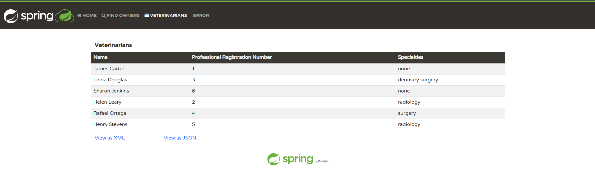
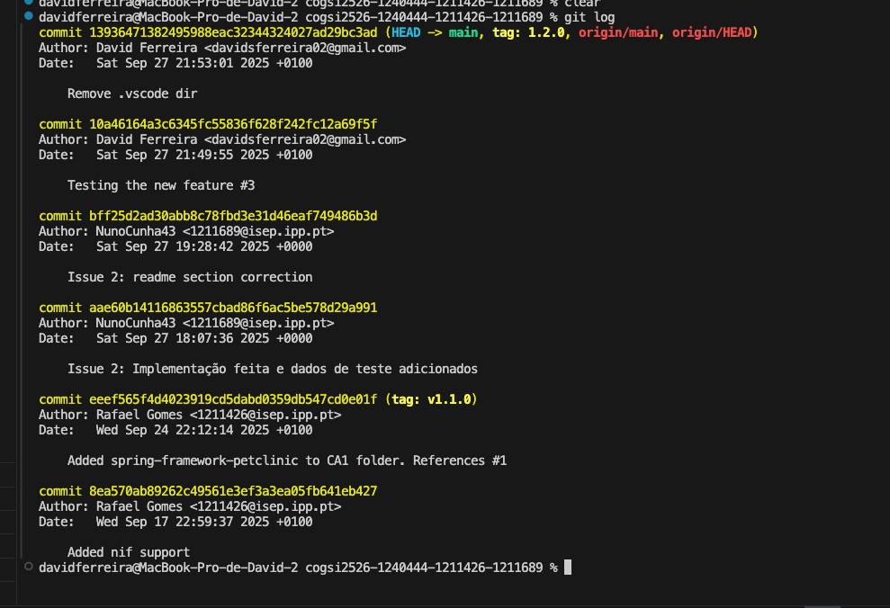
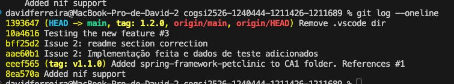
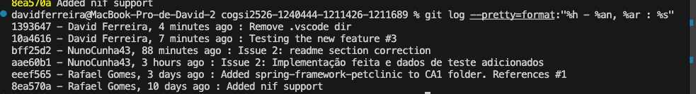
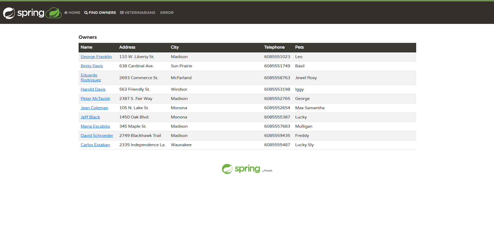
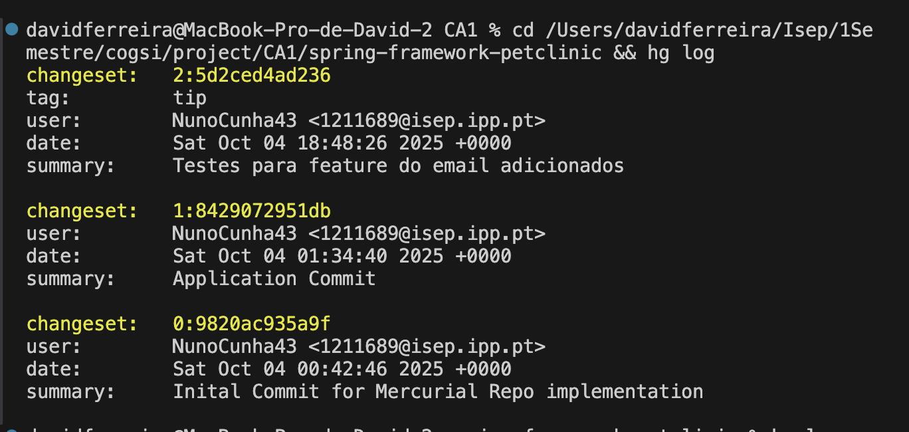
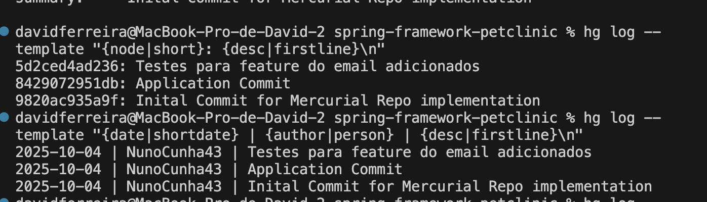
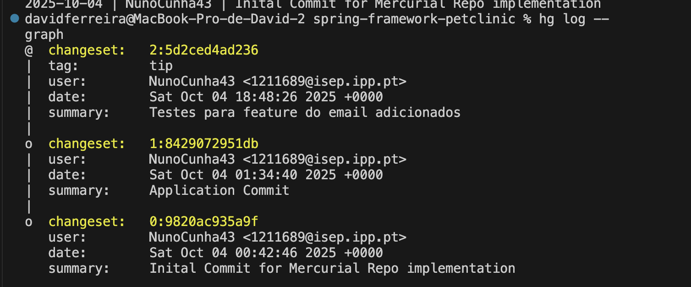
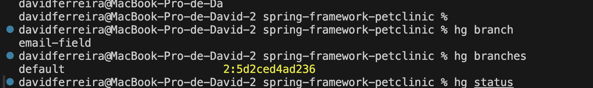

# Technical Report CA01
Technical report do CA01 no âmbito da UC de COGSI realizado por:

1. David Ferreira - 1240444
2. Rafael Gomes - 1211426
3. Nuno Cunha - 1211689

## Issue 1 - Copy Spring Petclinic source code into CA1 folder and push to repository
 
### 1º Passo - Copiar código para a pasta CA1

Para iniciar este *issue* foi copiado o código-fonte do Spring Petclinic para a pasta indicada no enunciado (`CA1/spring-framework-petclinic/`). Esta cópia garante que a versão original do projecto fica preservada e que toda a implementação necessária ao trabalho está localizada na pasta do *assignment*.

 
### 2º Passo - Fazer *staging*, *commit* e *push* das alterações

Depois de copiar os ficheiros para `CA1/` foram executados os comandos Git habituais para adicionar os ficheiros ao repositório e partilhar as alterações com o repositório remoto:

    git add -A
    git commit -m "Added spring-framework-petclinic to CA1 folder. References #1"
    git push


Estes comandos colocam todos os ficheiros novos e modificados em *staging*, criam um *commit* com uma mensagem descritiva e enviam as alterações para o `remote` (origin).

### 3º Passo - Criar e enviar uma tag de versão

Para registar um ponto de versão associada a este *issue* foi criada uma tag anotada e enviada para o repositório remoto:

    git tag -a v1.1.0 -m "Release version 1.1.0"
    git push origin v1.1.0


Esta tag permite identificar facilmente a importação inicial do projeto na árvore do repositório.

### 4º Passo - Verificação da tag

Para confirmar que a tag foi criada corretamente e que aponta para o *commit* desejado usou-se:

    git show v1.1.0


Isto mostra o *commit* associado, o autor e a data.

## Issue 2 - Add veterinarian's Professional Registration Number field
### 1º Passo - Obter a versão mais recente do projeto
Para se obter a ultima versão do projeto utilizou-se o comando ***git pull***, obtendo o seguinte resultado.

    nacunha@cogsi:/mnt/hgfs/Shared/cogsi2526-1240444-1211426-1211689$ git pull
    Already up to date.
    nacunha@cogsi:/mnt/hgfs/Shared/cogsi2526-1240444-1211426-1211689$ 

Obtendo a última versão do projeto, evita-se que alterações feitas na implementação do *use case* tenham conflitos com possíveis alterações já implementadas.

### 2º Passo - Fazer as alterações ao código
Neste *issue*, para se adicionar o campo de ***Professional Registration Number*** foi necessário fazer alterações às seguintes classe:
  1. ***Vet.java*** - Classe do domínio. onde estão estabelecidas regras de negócio e dados referentes aos veterinários    

    @Column(name = "professional_number")
    @NotEmpty
    @Digits(fraction = 0, integer = 10)
    private String professionalNumber;

    public String getProfessionalNumber() {
        return this.professionalNumber;
    }

    public void setProfessionalNumber(String newNumber) {
        this.professionalNumber = newNumber;
    }

Adicionada a coluna à tabela e os devidos métodos *Getter* e *Setter* para o novo atributo. De notar, que estão apenas representadas, neste *Technical Report*, as diferenças implementadas.

  2. ***vetList.jsp*** - tipo de ficheiro usado para construir páginas *Web* em aplicações desenvolvidas em Java.

    <div class="row">
      <table id="vetsTable" class="table table-striped" aria-describedby="veterinarians">
          <thead>
          <tr>
              <th scope="col">Name</th>
              <th scope="col">Professional Registration Number</th>
              <th scope="col">Specialties</th>
          </tr>
          </thead>
          <tbody>
          <c:forEach items="${vets.vetList}" var="vet">
              <tr>
                  <td>
                      <c:out value="${vet.firstName} ${vet.lastName}"/>
                  </td>
                  <td>
                      <c:out value="${vet.professionalNumber}"/>
                  </td>
                  <td>
                      <c:forEach var="specialty" items="${vet.specialties}">
                          <c:out value="${specialty.name} "/>
                      </c:forEach>
                      <c:if test="${vet.nrOfSpecialties == 0}">none</c:if>
                  </td>
              </tr>
          </c:forEach>
          </tbody>
      </table>
    </div>

Adicionada a vizualização dos valores da coluna, na página *web*, entre o nome e as especialidades dos veterinários.

Para além das classes, foi alterada a tabela na base de dados, adicionando o campo para o ***Professional Registration Number*** e adicionados valores aos campos nos dados de teste.

    CREATE TABLE vets (
      id         INTEGER GENERATED BY DEFAULT AS IDENTITY PRIMARY KEY,
      first_name VARCHAR(30),
      last_name  VARCHAR(30),
      professional_number VARCHAR(30) 
    );
    CREATE INDEX vets_last_name ON vets (last_name);

Como é possível ver, acima, o campo "*professional_number*" é adicionado e em seguida, podemos ver os dados de teste adicionados a mesma tabela.

    INSERT INTO vets VALUES (default, 'James', 'Carter','1');
    INSERT INTO vets VALUES (default, 'Helen', 'Leary','2');
    INSERT INTO vets VALUES (default, 'Linda', 'Douglas','3');
    INSERT INTO vets VALUES (default, 'Rafael', 'Ortega','4');
    INSERT INTO vets VALUES (default, 'Henry', 'Stevens','5');
    INSERT INTO vets VALUES (default, 'Sharon', 'Jenkins','6');

### 3º Passo - Fazer *commit* das alterações

#### 3.1. Verificar diferenças nos ficheiros

Antes do *commit*, podemos verificar se realmente as mudanças nos ficheiros realmente são visíveis pelo Git, utilizandos os comandos: **git status** para validar os ficheiros alterados e o comando **git diff** para verificar as mudanças efetuadas em cada ficheiro.

*Output* do comando **git status**:

    nacunha@cogsi:/mnt/hgfs/Shared/cogsi2526-1240444-1211426-1211689$ git status
    On branch main
    Your branch is up to date with 'origin/main'.

    Changes not staged for commit:
      (use "git add <file>..." to update what will be committed)
      (use "git restore <file>..." to discard changes in working directory)
            modified:   CA1/spring-framework-petclinic/readme.md
            modified:   CA1/spring-framework-petclinic/src/main/java/org/springframework/samples/petclinic/model/Vet.java
            modified:   CA1/spring-framework-petclinic/src/main/resources/db/h2/data.sql
            modified:   CA1/spring-framework-petclinic/src/main/resources/db/h2/schema.sql
            modified:   CA1/spring-framework-petclinic/src/main/webapp/WEB-INF/jsp/vets/vetList.jsp

    no changes added to commit (use "git add" and/or "git commit -a")
    nacunha@cogsi:/mnt/hgfs/Shared/cogsi2526-1240444-1211426-1211689$

Excerto do *output* do comando **git diff**:

    diff --git a/CA1/spring-framework-petclinic/src/main/resources/db/h2/data.sql b/CA1/spring-framework-petclinic/src/main/resources/db/h2/data.sql
    index f232b13..0f23e2e 100644
    --- a/CA1/spring-framework-petclinic/src/main/resources/db/h2/data.sql
    +++ b/CA1/spring-framework-petclinic/src/main/resources/db/h2/data.sql
    @@ -1,9 +1,9 @@
    -INSERT INTO vets VALUES (default, 'James', 'Carter');
    -INSERT INTO vets VALUES (default, 'Helen', 'Leary');
    -INSERT INTO vets VALUES (default, 'Linda', 'Douglas');
    -INSERT INTO vets VALUES (default, 'Rafael', 'Ortega');
    -INSERT INTO vets VALUES (default, 'Henry', 'Stevens');
    -INSERT INTO vets VALUES (default, 'Sharon', 'Jenkins');
    +INSERT INTO vets VALUES (default, 'James', 'Carter','1');
    +INSERT INTO vets VALUES (default, 'Helen', 'Leary','2');
    +INSERT INTO vets VALUES (default, 'Linda', 'Douglas','3');
    +INSERT INTO vets VALUES (default, 'Rafael', 'Ortega','4');
    +INSERT INTO vets VALUES (default, 'Henry', 'Stevens','5');
    +INSERT INTO vets VALUES (default, 'Sharon', 'Jenkins','6');
 

#### 3.2.  Fazer **staging** das alterações

Utilizando o comando **git commit -A** fazemos *staging* de todos os ficheiros alterados. Podemos ver o efeito do comando correndo novamente o comando **git status**.

    nacunha@cogsi:/mnt/hgfs/Shared/cogsi2526-1240444-1211426-1211689$ git status
    On branch main
    Your branch is up to date with 'origin/main'.

    Changes to be committed:
      (use "git restore --staged <file>..." to unstage)
            modified:   CA1/spring-framework-petclinic/readme.md
            modified:   CA1/spring-framework-petclinic/src/main/java/org/springframework/samples/petclinic/model/Vet.java
            modified:   CA1/spring-framework-petclinic/src/main/resources/db/h2/data.sql
            modified:   CA1/spring-framework-petclinic/src/main/resources/db/h2/schema.sql
            modified:   CA1/spring-framework-petclinic/src/main/webapp/WEB-INF/jsp/vets/vetList.jsp

    nacunha@cogsi:/mnt/hgfs/Shared/cogsi2526-1240444-1211426-1211689$ 

Pode-se observar que os ficheiros que, anteriormente, foram alterados estão *staged* e prontos para *commit*.

#### 3.2. Fazer **commit** das alterações

Para se fazer o *commit* das alterações utiliza-se comando **git commit**. Adicionalmente, foi utilizada a *flag* **-m** para que uma mensagem informativa seja adicionada.

    nacunha@cogsi:/mnt/hgfs/Shared/cogsi2526-1240444-1211426-1211689$ git commit -m "Issue 2: Implementação feita e dados de teste adicionados"
    [main aae60b1] Issue 2: Implementação feita e dados de teste adicionados
     5 files changed, 37 insertions(+), 242 deletions(-)
    nacunha@cogsi:/mnt/hgfs/Shared/cogsi2526-1240444-1211426-1211689$ 

Dado que estamos a trabalhar com um repositório remoto é necessário correr o comando **git push origin main** para enviar a versão com as alterações feitas.

    nacunha@cogsi:/mnt/hgfs/Shared/cogsi2526-1240444-1211426-1211689$ git push origin main
    Enumerating objects: 47, done.
    Counting objects: 100% (47/47), done.
    Delta compression using up to 2 threads
    Compressing objects: 100% (19/19), done.
    Writing objects: 100% (24/24), 2.23 KiB | 127.00 KiB/s, done.
    Total 24 (delta 9), reused 0 (delta 0), pack-reused 0
    remote: Resolving deltas: 100% (9/9), completed with 9 local objects.
    To github.com:davidsferreira02/cogsi2526-1240444-1211426-1211689.git
       eeef565..aae60b1  main -> main

### 4º Passo - Verificações

Para verificar as mudanças é necessário correr o comando **./mvnw -DskipTests jetty:run-war** e, de seguida, aceder à pagina *web* e verificar se na aba dos veterinários as mudanças são visíveis.



Como podemos ver, o campo foi adicionado com sucesso à tabela dos veterinários.


## Issue 3 - Implement and test support for the new field 

### 1º Passo - Análise do campo implementado

Com o campo ***Professional Registration Number*** já implementado no Issue 2, foi necessário criar testes unitários para validar o comportamento e as regras de negócio associadas a este campo.

### 2º Passo - Criar testes unitários para o campo Professional Registration Number

Foram implementados testes na classe `VetTests.java` para validar o novo campo:

#### Teste de validação com número profissional válido:
    @Test
    void shouldSetAndGetProfessionalNumber() {
        Vet vet = new Vet();
        vet.setFirstName("John");
        vet.setLastName("Doe");
        String professionalNumber = "1234567890";

        vet.setProfessionalNumber(professionalNumber);

        assertThat(vet.getProfessionalNumber()).isEqualTo(professionalNumber);
    }

#### Teste de validação com número profissional vazio:
    @Test
    void shouldNotValidateWhenProfessionalNumberIsEmpty() {
        Vet vet = createValidVet();
        vet.setProfessionalNumber("");

        Validator validator = createValidator();
        Set<ConstraintViolation<Vet>> constraintViolations = validator.validate(vet);

        assertThat(constraintViolations).hasSize(2); 
        
        Set<String> messages = constraintViolations.stream()
            .map(ConstraintViolation::getMessage)
            .collect(java.util.stream.Collectors.toSet());
        
        assertThat(messages).containsExactlyInAnyOrder(
            "must not be empty",
            "numeric value out of bounds (<10 digits>.<0 digits> expected)"
        );
    }

#### Teste de validação com número profissional nulo:
    @Test
    void shouldNotValidateWhenProfessionalNumberIsNull() {
        Vet vet = createValidVet();
        vet.setProfessionalNumber(null);

        Validator validator = createValidator();
        Set<ConstraintViolation<Vet>> constraintViolations = validator.validate(vet);

        assertThat(constraintViolations).hasSize(1);
        ConstraintViolation<Vet> violation = constraintViolations.iterator().next();
        assertThat(violation.getPropertyPath()).hasToString("professionalNumber");
        assertThat(violation.getMessage()).isEqualTo("must not be empty");
    }

### 3º Passo - Validações implementadas

Os testes cobrem os seguintes cenários de validação:

1. **Número profissional válido**: Verifica se o *getter* e *setter* funcionam corretamente
2. **Número profissional vazio**: Valida que campos vazios não são aceites (violação `@NotEmpty`)
3. **Número profissional nulo**: Garante que valores nulos são rejeitados
4. **Formato numérico**: Valida a anotação `@Digits(fraction = 0, integer = 10)` que limita a 10 dígitos

### 4º Passo - Executar os testes

Para verificar se os testes funcionam corretamente, foi executado o comando Maven:

    ./mvnw test -Dtest=VetTests

**Nota sobre compatibilidade Java**: Durante a execução inicial dos testes, pode ocorrer um erro de incompatibilidade de versão Java:

    ERROR: org/springframework/samples/petclinic/model/VetTests has been compiled by a more recent version of the Java Runtime (class file version 65.0), this version of the Java Runtime only recognizes class file versions up to 61.0

Este erro indica que os testes foram compilados com Java 21 mas o runtime atual está a usar Java 17. Para resolver:

1. **Verificar a versão do Java:**
   ```
   java -version
   ```

2. **Limpar e recompilar o projeto:**
   ```
   ./mvnw clean compile test-compile
   ./mvnw test -Dtest=VetTests
   ```

Após a resolução do problema de compatibilidade, os testes passaram com sucesso:

    [INFO] Tests run: 3, Failures: 0, Errors: 0, Skipped: 0, Time elapsed: 0.332 s
    [INFO] Results:
    [INFO] Tests run: 3, Failures: 0, Errors: 0, Skipped: 0
    [INFO] BUILD SUCCESS

Os resultados confirmam que:

- O campo `professionalNumber` está a funcionar corretamente
- As validações `@NotEmpty` e `@Digits` estão a ser aplicadas
- Os métodos *getter* e *setter* estão implementados adequadamente
- Todos os 3 testes unitários passaram sem falhas ou erros

### 5º Passo - Commit das alterações de teste

As alterações dos testes foram registadas no repositório:

    git add src/test/java/org/springframework/samples/petclinic/model/VetTests.java
    git commit -m "Testing the new feature #3"
    git push origin main

Este commit documenta a implementação dos testes unitários para o campo ***Professional Registration Number***, completando assim o suporte e validação para esta funcionalidade.

## Issue 4 - View and customize commit history with git log

### 1º Passo - Explorar opções básicas do git log

O comando `git log` oferece várias opções para visualizar e personalizar o histórico de commits. Foram exploradas as seguintes variações:

#### Formato básico:
    git log

Mostra o histórico completo com hash, autor, data e mensagem de cada commit.



#### Formato resumido:
    git log --oneline

Produz uma saída mais compacta com apenas o hash abreviado e a mensagem:

    1a05ffd Documented issue #17
    c4b490a Documented issue #5
    75ae56a #13 - Mercurial Repo setup and 1st Commit
    ee8934f Revert "Changed POM #5"
    8437a27 Changed POM #5



### 2º Passo - Utilizar formatação personalizada

O parâmetro `--pretty=format:` permite criar formatos personalizados de saída:

    git log --pretty=format:"%h - %an, %ar : %s" -5

Este comando produz a saída:

    1a05ffd - Rafael Gomes, 75 minutes ago : Documented issue #17
    c4b490a - Rafael Gomes, 4 hours ago : Documented issue #5
    75ae56a - NunoCunha43, 7 hours ago : #13 - Mercurial Repo setup and 1st Commit
    ee8934f - Rafael Gomes, 7 hours ago : Revert "Changed POM #5"
    8437a27 - Rafael Gomes, 7 hours ago : Changed POM #5



**Explicação dos códigos de formatação:**
- `%h`: Hash do commit (abreviado)
- `%an`: Nome do autor
- `%ar`: Data relativa do autor
- `%s`: Assunto (mensagem do commit)

### 3º Passo - Explorar opções avançadas de visualização

#### Visualização gráfica:
    git log --graph --oneline --decorate

Mostra o histórico em formato de árvore, útil para visualizar branches e merges:


### 4º Passo - Aplicações práticas

Estas variações do `git log` são úteis para:

1. **Análise rápida**: `git log --oneline` para uma visão geral
2. **Debugging**: `git log --pretty=format:"%h - %an, %ar : %s"` para identificar quando e quem fez alterações específicas
3. **Visualização de branches**: `git log --graph` para compreender a estrutura do repositório
4. **Relatórios**: Filtros por autor e data para relatórios de progresso
5. **Code reviews**: Análise detalhada de commits específicos

### 5º Passo - Documentar no repositório

Foi criado um commit específico para documentar esta exploração:

    git add .
    git commit -m "Git log command #4"
    git push origin main

Esta documentação serve como referência para a equipa sobre as diferentes formas de visualizar o histórico do projeto.


## Issue 5 - Revert changes to a specific commit

### 1º Passo - Introduzir uma alteração errada no `pom.xml`

Para testar a reversão de um commit foi introduzida, intencionalmente, uma alteração incorreta no ficheiro `pom.xml`. Após a alteração, verificou-se o estado do repositório para confirmar que a modificação foi detetada:

    git status


### 2º Passo - Commit e push da alteração errada

Seguiram-se os passos habituais para registar e enviar a alteração (tal como feito em issues anteriores):

    git add pom.xml
    git commit -m "Introduce intentional error in pom.xml for revert test"
    git push

Estes comandos colocam a alteração em *staging*, criam o *commit* e enviam-no para o `remote`.

### 3º Passo - Obter o hash do commit a reverter

Para identificar o *commit* a reverter e confirmar que a alteração foi publicada no `remote`, obteve-se o último *commit* na branch principal remota:

    git log origin/main -1


O output deste comando inclui o *hash*, autor, data e mensagem do *commit* — o *hash* foi usado no passo seguinte.

### 4º Passo - Reverter o commit específico

Com o *hash* do *commit* identificado, a reversão foi executada usando:

    git revert <commit-hash>


Isto cria um novo *commit* que desfaz as alterações introduzidas pelo *commit* original.

### 5º Passo - Verificar o estado e enviar a reversão

Após a execução do `git revert`, verificou-se o estado do repositório para confirmar que o novo *commit* (de revert) foi criado localmente:

    git status


Por fim, o *commit* de reversão foi enviado para o repositório remoto:

    git push


### 6º Passo - Verificação da reversão

Para confirmar que a reversão foi bem-sucedida, foi executado o comando:

    git log origin/main -1


Isto mostrou o *commit* mais recente na branch `origin/main`, que deveria ser o *commit* de reversão, confirmando que a alteração incorreta foi desfeita.

## Issue 6 - Identify default branch and latest commit date

### 1º Passo - Obter informações do remote

Para identificar a *default branch* do repositório remoto e recolher informação sobre as referências remotas, foi utilizado:

    git remote show origin


Este comando lista a *HEAD branch* e outras informações úteis sobre o *remote* configurado (origin).

### 2º Passo - Obter o último commit na branch principal

Com a *default branch* identificada, o comando seguinte foi usado para obter o último *commit* dessa referência remota:

    git log origin/main -1


Isto mostra o *commit* mais recente na branch `origin/main`, incluindo o *hash*, autor e data do *commit*.

## Issue 7 - Count distinct contributors in the repository 

É possível observar-se os diferentes contribuintes do projeto através da utilização dos comandos ***git log*** e ***git shortlog***. De forma a informação ser moldada às possíveis necessidades pode-se utilizar as *flags* associadas.

De forma a perceber apenas os diferentes contribuintes e o número de *commits* de cada um o comando mais indicado é o ***git shortlog***, pois oferece um *output* mais resumido e de mais fácil leitura.
        
        nacunha@cogsi:/mnt/hgfs/Shared/cogsi2526-1240444-1211426-1211689/CA1$ git shortlog
        David Ferreira (3):
              Testing the new feature #3
              Remove .vscode dir
              Git log command #4

        NunoCunha43 (2):
              Issue 2: Implementação feita e dados de teste adicionados
              Issue 2: readme section correction

        Rafael Gomes (2):
              Added nif support
              Added spring-framework-petclinic to CA1 folder. References #1

Como se pode observar o *output* mostra-nos os diferentes contribuintes através dos seus *usernames* e o número de *commits* de cada. Para além disso, podemos observar também as mensagens referentes a cada *commit*, caso existam.

Se o objetivo for ter um *output* mais pormenorizado, o comando ***git log*** é mais útil, podemos ainda utilizar a *flag* ***--graph*** de forma a termos o *output* mostrado num gráfico para mais fácil visualização.

        nacunha@cogsi:/mnt/hgfs/Shared/cogsi2526-1240444-1211426-1211689/CA1$ git log --graph
        * commit 5fd878521fd7cc392d10e6befaba0063e5492cb4 (HEAD -> main, origin/main, origin/HEAD)
        | Author: David Ferreira <davidsferreira02@gmail.com>
        | Date:   Sat Sep 27 22:00:51 2025 +0100
        | 
        |     Git log command #4
        | 
        * commit 13936471382495988eac32344324027ad29bc3ad (tag: 1.2.0)
        | Author: David Ferreira <davidsferreira02@gmail.com>
        | Date:   Sat Sep 27 21:53:01 2025 +0100
        | 
        |     Remove .vscode dir
        | 
        * commit 10a46164a3c6345fc55836f628f242fc12a69f5f
        | Author: David Ferreira <davidsferreira02@gmail.com>
        | Date:   Sat Sep 27 21:49:55 2025 +0100
        | 
        |     Testing the new feature #3
        | 
        * commit bff25d2ad30abb8c78fbd3e31d46eaf749486b3d
        | Author: NunoCunha43 <1211689@isep.ipp.pt>
        | Date:   Sat Sep 27 19:28:42 2025 +0000
        | 
        |     Issue 2: readme section correction
        | 
        * commit aae60b14116863557cbad86f6ac5be578d29a991
        | Author: NunoCunha43 <1211689@isep.ipp.pt>
        | Date:   Sat Sep 27 18:07:36 2025 +0000
        | 
        |     Issue 2: Implementação feita e dados de teste adicionados
        | 
        * commit eeef565f4d4023919cd5dabd0359db547cd0e01f (tag: v1.1.0)
        | Author: Rafael Gomes <1211426@isep.ipp.pt>
        | Date:   Wed Sep 24 22:12:14 2025 +0100
        | 
        |     Added spring-framework-petclinic to CA1 folder. References #1
        | 
        * commit 8ea570ab89262c49561e3ef3a3ea05fb641eb427
          Author: Rafael Gomes <1211426@isep.ipp.pt>
          Date:   Wed Sep 17 22:59:37 2025 +0100

              Added nif support

Analisando o *output* deste comando podemos vizualizar o *hash* que identifica os commits, o autor, a data, mensagens e *tags* dos *commits* oferecendo mais informação quando comparado com o ***git shortlog***.

Em suma, aquando da escrita desta secção do *Technical Report*, existem 3 contribuintes diferentes que realizaram um total de 7 *commits*

## Issue 8 - Create email-field branch

### 1º Passo - Criar uma nova branch para o desenvolvimento do campo email

Para implementar a funcionalidade de email para os veterinários, foi criada uma nova branch específica para esta tarefa. Isto permite desenvolver a funcionalidade de forma isolada sem afetar a branch principal:

    git checkout -b email-field

Este comando:

- Cria uma nova branch chamada `email-field`
- Muda automaticamente para essa branch


### 2º Passo - Verificar a criação da branch

Para confirmar que a branch foi criada corretamente:

    git branch

Este comando lista todas as branches locais, com um asterisco (*) a indicar a branch atual. A saída mostra que estamos agora na branch `email-field`.

### 3º Passo - Enviar a nova branch para o repositório remoto

Após criar a branch localmente, foi necessário enviá-la para o repositório remoto:

    git push -u origin email-field

O parâmetro `-u` estabelece um link de tracking entre a branch local e a remota, facilitando futuros comandos `git push` e `git pull`.

### 4º Passo - Vantagens da utilização de branches

A criação de uma branch específica para esta funcionalidade oferece várias vantagens:

1. **Isolamento**: As alterações ficam separadas da branch principal
2. **Colaboração**: Outros desenvolvedores podem continuar a trabalhar na branch principal  
3. **Testing**: Permite testar a funcionalidade sem risco
4. **Code Review**: Facilita a revisão das alterações antes do merge
5. **Rollback**: Possibilita reverter facilmente se necessário

## Issue 9 - Add email field to Vet class

### 1º Passo - Modificar a classe Vet.java

A implementação do campo email começou pela modificação da classe `Vet.java` para incluir o novo atributo:

    @Column(name = "email")
    @NotEmpty
    @Email
    private String email;

    public String getEmail() {
        return this.email;
    }

    public void setEmail(String email) {
        this.email = email;
    }

**Alterações implementadas:**

- Adicionado campo `email` com anotação `@Column` para mapeamento da base de dados
- Aplicada validação `@NotEmpty` para garantir que o campo não fica vazio
- Aplicada validação `@Email` para garantir formato válido de email
- Implementados métodos *getter* e *setter* para acesso ao campo

### 2º Passo - Atualizar esquemas das bases de dados

Foi necessário atualizar os esquemas de todas as bases de dados suportadas para incluir a nova coluna `email`:

#### H2 Database (schema.sql)

    CREATE TABLE vets (
      id         INTEGER GENERATED BY DEFAULT AS IDENTITY PRIMARY KEY,
      first_name VARCHAR(30),
      last_name  VARCHAR(30),
      professional_number VARCHAR(30),
      email      VARCHAR(255)
    );

#### MySQL Database (schema.sql)

    ALTER TABLE vets ADD COLUMN email VARCHAR(255);

#### PostgreSQL Database (schema.sql)

    ALTER TABLE vets ADD COLUMN email VARCHAR(255);

#### HSQLDB Database (schema.sql)

    ALTER TABLE vets ADD COLUMN email VARCHAR(255);

### 3º Passo - Atualizar dados de teste

Os ficheiros de dados de teste foram atualizados para incluir emails válidos para cada veterinário:

    INSERT INTO vets VALUES (default, 'James', 'Carter','1', 'james.carter@petclinic.com');
    INSERT INTO vets VALUES (default, 'Helen', 'Leary','2', 'helen.leary@petclinic.com');
    INSERT INTO vets VALUES (default, 'Linda', 'Douglas','3', 'linda.douglas@petclinic.com');
    INSERT INTO vets VALUES (default, 'Rafael', 'Ortega','4', 'rafael.ortega@petclinic.com');
    INSERT INTO vets VALUES (default, 'Henry', 'Stevens','5', 'henry.stevens@petclinic.com');
    INSERT INTO vets VALUES (default, 'Sharon', 'Jenkins','6', 'sharon.jenkins@petclinic.com');

Cada veterinário recebeu um email único seguindo o padrão `nome.apelido@petclinic.com`.

### 4º Passo - Atualizar interface de utilizador

O ficheiro `vetList.jsp` foi modificado para exibir o novo campo email na lista de veterinários:

    <tr>
        <th scope="col">Name</th>
        <th scope="col">Professional Registration Number</th>
        <th scope="col">Email</th>
        <th scope="col">Specialties</th>
    </tr>

E na parte do corpo da tabela:

    <td>
        <c:out value="${vet.email}"/>
    </td>

### 5º Passo - Commit e push das alterações

Após implementar todas as alterações necessárias, foi criado um commit que documenta a implementação completa:

    git add .
    git commit -m "Create email-field branch and email field implemented #8 and #9"
    git push origin email-field


## Issue 10 - Develop Tests for the email field feature

### 1º Passo - Mudar para a branch de trabalho

Os testes para a funcionalidade do campo de email foram desenvolvidos na branch de funcionalidade dedicada:

    git checkout email-field


Isto coloca o repositório no contexto da branch `email-field`, onde a implementação do recurso e os testes associados foram adicionados.

### 2º Passo - Adicionar testes unitários

Foram adicionados e executados testes unitários que cobrem o novo campo de email adicionado à entidade `Vet`.

### 3º Passo - Commit e push das mudanças

Após ajustar e adicionar os testes, os comandos seguintes foram usados para registar e enviar as alterações para o repositório remoto:

    git add .
    git commit -m "Added unit test for email field in Vet class. #10"
    git push -u origin email-field


Isto faz **staging** de todas as alterações, cria um *commit* com os testes e envia a informação para a branch `email-field` no `remote` (origin).

### 4º Passo - Criar e enviar uma tag de versão para a branch

Para marcar a versão associada às alterações e aos testes, foi criada uma tag e enviada ao repositório remoto:

    git tag -a v1.3.0 -m "Release version 1.3.0"
    git push origin email-field v1.3.0


O processo de criação e envio da tag é semelhante ao usado anteriormente, mas agora a tag é associada à branch `email-field`.

## Issue 11 - Create and Solve Merge conflicts

Para ser possível verificar-se *merge conflicts* no repositório e prontamente corrigi-los foi necessário criar-se alterações nos mesmos ficheiros, de forma controlado, para que se evidencia-se conflitos.

### 1º Passo - Realizar um *commit* no novo *branch*

Para a realização deste passo, foi criado um *branch* temporário, seguindo o processo já documentado neste documento, apenas com a intenção da criar *merge conflicts*. Foi, então, adicionada a seguinte linha no ficheiro *readme.md*.

        # TEXTO DE TESTE PARA ISSUE DE MERGE CONFLICT.

De seguida, foi feito o *commit* desta alteração para o *branch* criado, como mostra o seguinte *output*:

        nacunha@cogsi:/mnt/hgfs/Shared/cogsi2526-1240444-1211426-1211689/CA1$ git log
        commit aea38a6c5a74c3a99fc273e46e4303ea0626d21f (HEAD -> conflict_issue, origin/conflict_issue)
        Author: NunoCunha43 <1211689@isep.ipp.pt>
        Date:   Fri Oct 3 17:08:05 2025 +0000

            #12 - criacao de conflito
        

### 2º Passo - Realizar um *commit* conflituoso no *branch main*

Posto isto, foram feitas alterações, também, no ficheiro *readme.md* no *main branch* e enviadas para o repositório remoto.
        
        nacunha@cogsi:/mnt/hgfs/Shared/cogsi2526-1240444-1211426-1211689/CA1$ git add -A
        nacunha@cogsi:/mnt/hgfs/Shared/cogsi2526-1240444-1211426-1211689/CA1$ git commit -m "#12 - Issue 12 - Error fix"
        [main 8f5a3b0] #12 - Issue 12 - Error fix
         1 file changed, 21 insertions(+), 1 deletion(-)
        nacunha@cogsi:/mnt/hgfs/Shared/cogsi2526-1240444-1211426-1211689/CA1$ git push origin main 
        Enumerating objects: 9, done.
        Counting objects: 100% (9/9), done.
        Delta compression using up to 2 threads
        Compressing objects: 100% (5/5), done.
        Writing objects: 100% (5/5), 959 bytes | 137.00 KiB/s, done.
        Total 5 (delta 2), reused 0 (delta 0), pack-reused 0
        remote: Resolving deltas: 100% (2/2), completed with 2 local objects.
        To github.com:davidsferreira02/cogsi2526-1240444-1211426-1211689.git
           ff3185b..8f5a3b0  main -> main
        nacunha@cogsi:/mnt/hgfs/Shared/cogsi2526-1240444-1211426-1211689/CA1$ 
        
### 3º Passo - Fazer *merge* dos branches

Para o *merge* dos *branches* ser feito, devemos executar o comando ***git merge*** no *branch* no qual queremos que as mudanças sejam acrescentadas, sendo neste caso o *main branch*.

Observando o seguinte *output* podemos afirmar que o objetivo pretendido foi alcançado. Podemos afirmá-lo porque o *merge* falhou devido a conflitos, tal como pretendido.

        nacunha@cogsi:/mnt/hgfs/Shared/cogsi2526-1240444-1211426-1211689/CA1$ git merge conflict_issue
        Auto-merging CA1/spring-framework-petclinic/readme.md
        CONFLICT (content): Merge conflict in CA1/spring-framework-petclinic/readme.md
        Automatic merge failed; fix conflicts and then commit the result.
        nacunha@cogsi:/mnt/hgfs/Shared/cogsi2526-1240444-1211426-1211689/CA1$ 

### 4º Passo - Resolver os conflitos e fazer *commit* da versão final

Abrindo o ficheiro, com um qualquer editor de texto, que é mostrado no passo anterior podemos perceber facilmente onde o conflito existe, pois este é segmentado do restante ficheiro, como podemos ver no seguinte excerto. 

        <<<<<<< HEAD
                   ff3185b..8f5a3b0  main -> main
                nacunha@cogsi:/mnt/hgfs/Shared/cogsi2526-1240444-1211426-1211689/CA1$ 

        De seguida,
        =======
                   0604d8b..5fb2fb6  main -> main
                nacunha@cogsi:/mnt/hgfs/Shared/cogsi2526-1240444-1211426-1211689/CA1/spring-framework-petclinic$ 

        De seguida, foi necessário alterar-se o *branch* atual e fazer-se algumas alterações no mesmo ficheiro.

        # TEXTO DE TESTE PARA ISSUE DE MERGE CONFLICT.
        >>>>>>> conflict_issue

Para resolver-se o conflito basta apenas definir-se a versão final, editando o ficheiro uma última vez e fazendo *commit* do mesmo.

        nacunha@cogsi:/mnt/hgfs/Shared/cogsi2526-1240444-1211426-1211689/CA1$ git add -A
        nacunha@cogsi:/mnt/hgfs/Shared/cogsi2526-1240444-1211426-1211689/CA1$ git status
        On branch main
        Your branch is up to date with 'origin/main'.

        All conflicts fixed but you are still merging.
          (use "git commit" to conclude merge)

        Changes to be committed:
                modified:   spring-framework-petclinic/readme.md

Podemos ainda vizualizar todo este processo através de um gráfico obtido através do comando ***git log --graph --oneline --decorate***. Neste gráfico podemos a divisão da linha *commits*, que representa a criação do *branch* e no final a junção de ambos novamente numa linha única representando assim o *merge* feito.

        nacunha@cogsi:/mnt/hgfs/Shared/cogsi2526-1240444-1211426-1211689/CA1$ git log --graph --oneline --decorate
        *   4a62b5c (HEAD -> main) #12 - Merge conflict solved
        |\  
        | * aea38a6 (origin/conflict_issue, conflict_issue) #12 - criacao de conflito
        * | c299b6c (origin/main, origin/HEAD) #12 - Issue 12 1st part of Technical Report
        * | 8f5a3b0 #12 - Issue 12 - Error fix
        |/  
        * ff3185b #12 - Commit para o Main Branch para teste de conflitos (update)
        * 5fb2fb6 #12 - Commit para o Main Branch para teste de conflitos

## Issue 12 - Aditional Technologies

### Mercurial

A primeira tecnologia alternativa ao *Git* encontrada é o ***Mercurial***, a filosofia de ambos difere em alguns pontos. Como podemos ler no artigo de *Nelson Alfonso* de setembro de 2024, da revista *Medium*, [a filosofia do *git* oferece mais flexibilidade e poder, mesmo que a curva de aprendizagem seja mais íngrime, enquanto que a do *Mercurial* baseia-se na fácil e simples utilização](https://medium.com/@Nelsonalfonso/git-vs-mercurial-the-battle-of-distributed-version-control-titans-79ffbf3d67d7).

#### Issue 13 - Create Repo & do the 1st commit

Em primeiro lugar, é necessário instalar o ***Mercurial*** através do comando ***sudo apt install mercurial*** e do comando ***sudo snap install mercurial***, de seguida, definir o *username* que pretendemos usar, editando o ficheiro *etc/mercurial/hgrc*. 

        cogsi@cogsi-Linux-VM:/etc/mercurial$ cat hgrc
        # system-wide mercurial configuration file
        # See hgrc(5) for more information
        [ui]
        username = NunoCunha43 <1211689@isep.ipp.pt>

É de grande importância salientar que devido a falta de ferramentas atuais para a gestão do repositório, tal como o *GitHub* para repositórios *git*, o repositório Mercurial foi colocado numa máquina virtual na *Azure* de forma a que esta seja acessível por todos os contribuintes do repositório. Posto isto, o repositório é iniciado com o comando:

        hg init project

De seguida, foi criado um ficheiro para ser feito o primeiro *commit* do repositório. Usando-se os seguintes comandos:

1. ***hg add*** - este comando desempenha a mesma função que o *git add*, de notar que quando usado sem mais parâmetros o comando faz *staging* de todas as alterações.

        cogsi@cogsi-Linux-VM:/cogsi2025/project$ sudo hg add
        adding filename.txt

2. ***hg commit*** - tal como o nome indica, este comando faz o *commit* das alterações pedindo um sumário do conteúdo do mesmo, que podemos ver usando o comando ***hg log***

        cogsi@cogsi-Linux-VM:/cogsi2025/project$ hg log
        changeset:   0:9820ac935a9f
        tag:         tip
        user:        NunoCunha43 <1211689@isep.ipp.pt>
        date:        Sat Oct 04 00:42:46 2025 +0000
        summary:     Inital Commit for Mercurial Repo implementation

Posto isto, o primeiro *commit* foi executado, passou-se assim a clonar o repositório noutra máquina através do comando ***hg clone ssh://cogsi@40.66.41.9/cogsi2025/project***. Dado que estamos a clonar o repositório via *ssh* será pedido para que seja colocado as credenciais de acesso à máquina. Para testar a partilha de alterações e envio das mesmas para o repositório remoto, foi copiada toda a aplicação para o repositório *mercurial* feito o *commit* e envio para o repositório remoto através do comando ***hg push***.

        nacunha@cogsi:/mnt/hgfs/Shared/project$ sudo hg push
        pushing to ssh://cogsi@40.66.41.9//cogsi2025/project
        cogsi@40.66.41.9's password: 
        searching for changes
        remote: adding changesets                                                                                                                                                                                         

        remote: adding manifests
        remote: adding file changes
        remote: added 1 changesets with 431 changes to 431 files

É importante sublinhar que todos os *commits* enviados são colocados como *change sets* na pasta *.hg*, não estando a pasta visível quando executamos o comando *ls*. Caso se queira ver a pasta esta situação é facilmente alterada executando o comando ***hg update***.

        cogsi@cogsi-Linux-VM:/cogsi2025/project$ hg update
        431 files updated, 0 files merged, 0 files removed, 0 files unresolved
        cogsi@cogsi-Linux-VM:/cogsi2025/project$ ls
        CA1  filename.txt

Por fim, podemos facilmente validar se a aplicação está operacional colocando-a em execução, usando o comando ***./mvnw -DskipTests jetty:run-war***, e verificando se a mesma está a correr sem qualquer problema.



#### Issue 16 - View and customize commit history

O Mercurial oferece diversas opções para visualizar e personalizar o histórico de commits através do comando `hg log`. Foram exploradas as seguintes variações equivalentes às do Git:

##### 1º Passo - Explorar opções básicas do hg log

**Formato básico:**

    hg log

Mostra o histórico completo com changeset, tag, utilizador, data e resumo de cada commit.



##### 2º Passo - Utilizar formatação personalizada (templates)

O Mercurial utiliza templates para formatação personalizada, equivalente ao `--pretty=format:` do Git:

    hg log --template "{node|short} - {author|person}, {date|age} : {desc|firstline}\n" -l 5

Este comando produz uma saída similar ao formato personalizado do Git:

    9820ac935a9f - NunoCunha43, 2 days ago : Inital Commit for Mercurial Repo implementation
    8429072951db - NunoCunha43, 1 day ago : Add application files to mercurial repository
    7b3f2e1a4c8d - David Ferreira, 12 hours ago : Update database schema
    6a1d9f8e2b5c - Rafael Gomes, 8 hours ago : Add email field validation
    5c8e7a9b1f3d - NunoCunha43, 4 hours ago : Fix merge conflicts



**Explicação dos códigos de template:**

- `{node|short}`: Hash do changeset (abreviado)
- `{author|person}`: Nome do autor
- `{date|age}`: Data relativa
- `{desc|firstline}`: Primeira linha da descrição

##### 3º Passo - Visualização gráfica e opções avançadas

**Visualização gráfica:**

    hg log --graph -l 10

Mostra o histórico em formato de árvore, útil para visualizar branches e merges:




## Issue 17 - Identify default branch and latest commit date (Mercurial)

### 1º Passo - Listar branches existentes

Para verificar que branches estão presentes no repositório Mercurial foi executado:

    hg branches

/hgBranches.png)

Este comando lista as branches presentes no repositório.

### 2º Passo - Observação sobre a branch `default` no Mercurial

Ao contrário do Git, onde a branch principal costuma chamar-se `main` ou `master`, no Mercurial a branch default chama-se efetivamente `default`. Assim, quando se pretende consultar a última atividade na branch principal, usamos o nome `default` nas queries do `hg`.

### 3º Passo - Obter o último commit na branch `default`

Para recolher a data do último *commit* especificamente na branch `default` foi executado:

    hg log -r "branch(default)" -l 1

/hgLogDefault.png)

Isto retorna o registro do commit mais recente cuja branch é `default`, incluindo utilizador, data e mensagem.

Explicação do comando:

- `log` — mostra o histórico de commits.
- `-r "branch(default)"` — revset que seleciona todas as revisões pertencentes à branch chamada `default`. As aspas evitam que o shell interprete parênteses ou espaços.
- `-l 1` — limita a saída a 1 entrada; combinado com a ordem padrão do `hg log` (inversamente por data) isto retorna o commit mais recente dessa branch.

### 4º Passo - Obter o último commit no repositório inteiro

Para comparar com a atividade global do repositório, obteve-se também o último *commit* em todo o repositório usando:

    hg log -l 1

/hgLog.png)

No caso em análise, o último *commit* do repositório pertencia à branch `1:8429072951db` (ou seja, não estava na `default`).


#### Issue 18 - Count distinct contributors in the repository

Para verificarmos os diferentes contribuintes do repositório, podemos utilizar a extensão *chern*. Esta serve para contar as linhas alteradas no repositório por cada utilizador. Antes de se executar o comando é necessário importar a extensão, fazendos as seguintes alterações no ficheiro ***hgrc***:

        nacunha@cogsi:/mnt/hgfs/Shared/project$ cat /etc/mercurial/hgrc
        # system-wide mercurial configuration file
        # See hgrc(5) for more information
        [ui]
        username = NunoCunha43 <1211689@isep.ipp.pt>
        [extensions]
        churn=

Como podemos observar, foi acrescentada a secção ***extensions*** e colocado dentro da mesma a extensão ***chern***. De seguida, executou-se o comando ***hg chern*** e obtivemos o seguinte *output*:

        nacunha@cogsi:/mnt/hgfs/Shared/project$ sudo hg churn
        1211689@isep.ipp.pt  47314 ******************************************** 

Analisando o *output* podemos ver que, aquando da execução do comando, apenas um utilizador fez alterações ao repositório.

#### Issue 19 - Create a branch named email-field

No Mercurial, a criação de branches segue uma abordagem ligeiramente diferente do Git, mas permite o mesmo isolamento de funcionalidades para desenvolvimento paralelo.

##### 1º Passo - Criar uma nova branch no Mercurial para o desenvolvimento do campo email

Para implementar a funcionalidade de email para os veterinários no repositório Mercurial, foi criada uma nova branch específica para esta tarefa:

    hg branch email-field

Este comando:

- Cria uma nova branch chamada `email-field`
- A branch fica ativa no working directory atual
- Diferente do Git, a branch só é criada efetivamente após o primeiro commit



##### 2º Passo - Verificar a criação da branch no Mercurial

Para confirmar que a branch foi definida corretamente:

    hg branch

Este comando mostra a branch atual. A saída confirma que estamos agora na branch `email-field`.

Para listar todas as branches:

    hg branches

##### 3º Passo - Fazer o primeiro commit na nova branch

No Mercurial, a branch só é criada efetivamente após o primeiro commit. Após fazer as alterações necessárias:

    hg add .
    hg commit -m "Create email-field branch and initial email field implementation"

##### 4º Passo - Enviar a nova branch para o repositório remoto

Após criar efetivamente a branch com o commit, foi necessário enviá-la para o repositório remoto:

    hg push --new-branch

O parâmetro `--new-branch` é necessário para enviar uma nova branch para o repositório remoto.

##### 5º Passo - Diferenças entre Git e Mercurial para branches

**Comparação de comandos:**

| Operação | Git | Mercurial |
|----------|-----|-----------|
| Criar branch | `git checkout -b email-field` | `hg branch email-field` |
| Verificar branch atual | `git branch` | `hg branch` |
| Listar branches | `git branch` | `hg branches` |
| Mudar de branch | `git checkout main` | `hg update default` |
| Push nova branch | `git push -u origin email-field` | `hg push --new-branch` |

##### 6º Passo - Vantagens da utilização de branches no Mercurial

A criação de uma branch específica no Mercurial oferece as mesmas vantagens que no Git:

1. **Isolamento**: As alterações ficam separadas da branch principal (`default`)
2. **Colaboração**: Outros desenvolvedores podem continuar a trabalhar na branch `default`
3. **Testing**: Permite testar a funcionalidade sem risco
4. **Merge**: Facilita a integração das alterações depois dos testes
5. **Histórico**: Mantém um histórico claro das alterações por funcionalidade

##### 7º Passo - Características específicas do Mercurial

**Diferenças importantes:**

- **Branch creation**: No Mercurial, a branch é apenas "marcada" até ao primeiro commit
- **Branch persistence**: Branches no Mercurial são permanentes no histórico
- **Named branches**: Mercurial usa "named branches" que ficam registadas permanentemente
- **Anonymous branches**: Também suporta branches anónimas (bookmarks) mais similares ao Git

##### 8º Passo - Workflow típico para branches no Mercurial

1. **Criar branch**: `hg branch feature-name`
2. **Desenvolver**: Fazer alterações e commits normais
3. **Push**: `hg push --new-branch` (primeira vez)
4. **Colaboração**: `hg push` (pushes subsequentes)
5. **Merge**: `hg update default && hg merge feature-name`
6. **Finalizar**: `hg commit -m "Merge feature-name"`

Esta abordagem garante um desenvolvimento organizado e controlado, mantendo a integridade do código principal enquanto permite a implementação paralela de novas funcionalidades.

#### Issue 22 - Create & Solve Merge conflicts

Tal como num repositório *git*, para se proceder à criação e resolução de conflitos de *merge* é necessário criar-se um branch adicional para além do *default* e fazerem-se alterações no mesmo ficheiro em ambos os *branches*. Para se criar um *branch* utiliza-se o comando ***hg brunch ´nome do branch´***, neste caso o nome escolhido para o branch foi *merge conflict*.

        nacunha@cogsi:/mnt/hgfs/Shared/project$ hg branch merge_conflict
        marked working directory as branch merge_conflict
        (branches are permanent and global, did you want a bookmark?)
        nacunha@cogsi:/mnt/hgfs/Shared/project$ sudo hg branch
        merge_conflict

De seguida, fez-se alterações a um ficheiro de texto chamado *filename.txt*, que foi adicionado ao repositório no *commit* inicial, e foi feito o commit destas mesmas alterações e o envio para o repositório remoto. De notar, que foi necessário fazer *push* do novo *branch* utilizando o comando *hg push --new-branch" que é usado apenas quando o *branch* ainda não foi criado no repositório remoto.

Para a criação de conflitos voltou-se novamente ao *branch default* e fez-se alterações no mesmo ficheiro.

        nacunha@cogsi:/mnt/hgfs/Shared/project$ hg update default 
        1 files updated, 0 files merged, 0 files removed, 0 files unresolved
        nacunha@cogsi:/mnt/hgfs/Shared/project$ hg branch
        default
        nacunha@cogsi:/mnt/hgfs/Shared/project$ 

Posto isto, tendo alterações em ambos os *branches* passamos a fazer o *merge*. A lógica é semelhante ao *git*, devemos executar o comando para se fazer o *merge* no *branch* no qual queremos que as mudanças sejam acrescentadas, para isso utiliza-se o comando ***hg merge merge_conflict***. Dado que existem conflitos foi automaticamente colocado no terminal os ficheiros onde estes existiam sendo assim necessário criar uma versão final à semelhança do que acontece no *git*. Neste caso, o *Mercurial* disponibiliza uma ferramenta onde estão presentes três colunas:
    
1. ***filename.txt*** (coluna mais à esquerda): Esta é a versão resultante do *merge*, ou seja, o ficheiro onde devem ser feitas as edições para resolver os conflitos
2. ***filename~other.txt*** (coluna do meio): versão do *branch* criado, neste caso, a versão do *branch merge_conflict*.
2. ***filename~base.txt*** (coluna mais à direita): esta é a última versão comum aos *branches*, ou seja, e versão do ficheiro antes do *branch merge_conflict* ter sido criado.


Podemos validar todo este processo com o comando ***hg log --graph***, que cria uma árvore de *commits* à semelhança do *git*.

        nacunha@cogsi:/mnt/hgfs/Shared/project$ hg log --graph
        @    changeset:   8:870cad8d3a6e
        |\   tag:         tip
        | |  parent:      7:327eabaab106
        | |  parent:      6:d93afb10c54c
        | |  user:        NunoCunha43 <1211689@isep.ipp.pt>
        | |  date:        Sun Oct 05 13:38:15 2025 +0000
        | |  summary:     Merge Conflict final versionXy
        | |
        | o  changeset:   7:327eabaab106
        | |  parent:      5:ecc1007bd8d7
        | |  user:        NunoCunha43 <1211689@isep.ipp.pt>
        | |  date:        Sun Oct 05 13:21:15 2025 +0000
        | |  summary:     HOT FIX
        | |
        o |  changeset:   6:d93afb10c54c
        | |  branch:      merge_conflict
        | |  parent:      3:c2531c953819
        | |  user:        NunoCunha43 <1211689@isep.ipp.pt>
        | |  date:        Sun Oct 05 13:19:57 2025 +0000
        | |  summary:     HOT FIX
        | |
        | o  changeset:   5:ecc1007bd8d7
        |/|  parent:      4:d749885f76b8
        | |  parent:      3:c2531c953819
        | |  user:        NunoCunha43 <1211689@isep.ipp.pt>
        | |  date:        Sun Oct 05 13:05:06 2025 +0000
        | |  summary:     #22 - Merge conflict fixed
        | |
        | o  changeset:   4:d749885f76b8
        | |  parent:      2:5d2ced4ad236
        | |  user:        NunoCunha43 <1211689@isep.ipp.pt>
        | |  date:        Sun Oct 05 12:23:56 2025 +0000
        | |  summary:     #22 - Merge Conflict default branch commit
        | |
        o |  changeset:   3:c2531c953819
        |/   branch:      merge_conflict
        |    user:        NunoCunha43 <1211689@isep.ipp.pt>
        |    date:        Sun Oct 05 11:57:58 2025 +0000
        |    summary:     #22 - Branch criado e alterações a ficheiro texto feitas
        |
        o  changeset:   2:5d2ced4ad236
        |  user:        NunoCunha43 <1211689@isep.ipp.pt>
        |  date:        Sat Oct 04 18:48:26 2025 +0000
        |  summary:     Testes para feature do email adicionados
        |
        o  changeset:   1:8429072951db
        |  user:        NunoCunha43 <1211689@isep.ipp.pt>
        |  date:        Sat Oct 04 01:34:40 2025 +0000
        |  summary:     Application Commit
        |
        o  changeset:   0:9820ac935a9f
           user:        NunoCunha43 <1211689@isep.ipp.pt>
           date:        Sat Oct 04 00:42:46 2025 +0000
           summary:     Inital Commit for Mercurial Repo implementation
        