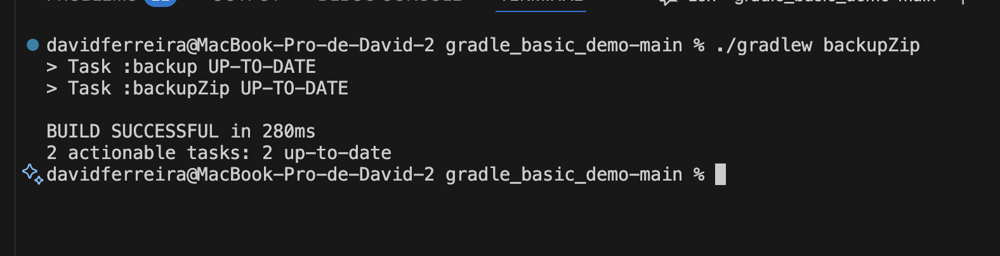

# Technical Report CA02

Technical report do CA02 no âmbito da UC de COGSI realizado por:

1. David Ferreira - 1240444
2. Rafael Gomes - 1211426
3. Nuno Cunha - 1211689

## Issue 24 - Add custom Gradle task runServer

Em primeiro lugar, é necessário compreender o que deve ser feito para colocar o módulo da app em execução. Para isso, é preciso fazer o *build* do projeto e executar o comando ***java -cp build/libs/basic_demo-0.1.0.jar basic_demo.ChatServerApp "server port"***, conforme indicado no ficheiro README.
Este comando serve para indicar qual o método main que deve ser executado e para definir os argumentos necessários ao seu funcionamento.

        nacunha@cogsi$ ./gradlew build
        > Task :compileJava UP-TO-DATE
        > Task :processResources UP-TO-DATE
        > Task :classes UP-TO-DATE
        > Task :jar UP-TO-DATE
        > Task :startScripts UP-TO-DATE
        > Task :distTar UP-TO-DATE
        > Task :distZip UP-TO-DATE
        > Task :assemble UP-TO-DATE
        > Task :compileTestJava NO-SOURCE
        > Task :processTestResources NO-SOURCE
        > Task :testClasses UP-TO-DATE
        > Task :test NO-SOURCE
        > Task :check UP-TO-DATE
        > Task :build UP-TO-DATE

        BUILD SUCCESSFUL in 845ms
        6 actionable tasks: 6 up-to-date
        nacunha@cogsi$ java -cp build/libs/basic_demo-0.1.0.jar basic_demo.ChatServerApp 59001
        The chat server is running...

**NOTA**: o caminho para a pasta foi abreviado de forma a facilitar a leitura do *output*.

Posto isto, é agora necessário proceder à criação da *task* no ficheiro ***build.gradle***:

        task runServer(type:JavaExec){
            group = "COGSI"

            description = "Task that starts the Chat App"

            dependsOn build

            classpath = sourceSets.main.runtimeClasspath

            mainClass = 'basic_demo.ChatServerApp'

            args '59001'
        }

Analisando a mesma por linhas, podemos observar o seguinte:

1. A *task* criada é do tipo *JavaExec*, o que significa que a mesma irá executar uma aplicação *Java* num processo filho.
2. Foi criado um grupo de *tasks* com o nome COGSI, para fins organizacionais.
3. Dada uma descrição pertinente do objetivo da mesma.
4. Utilizando a ferramenta de ordenação de *tasks* ***dependsOn*** garantimos que a *task* criada irá ser executada caso o *build* do projeto seja bem sucedido.
5. A variável ***classpath*** serve para informar o *Gradle* sobre onde encontrar o código compilado, os recursos e as bibliotecas necessárias para executar o programa.
6. A variável ***mainClass*** indica ao *Gradle* qual a classe que contém o método *main* a ser executado sendo-lhes passados os parâmetros necessários, sendo neste caso apenas o porto onde deve ser executada a aplicação.

Tendo já sido criada a *task* resta testar o seu funcionamento utilizando o comando ***./gradlew runServer***.

        nacunha@cogsi$ ./gradlew runServer
        > Task :compileJava UP-TO-DATE
        > Task :processResources UP-TO-DATE
        > Task :classes UP-TO-DATE
        > Task :jar UP-TO-DATE
        > Task :startScripts UP-TO-DATE
        > Task :distTar UP-TO-DATE
        > Task :distZip UP-TO-DATE
        > Task :assemble UP-TO-DATE
        > Task :compileTestJava NO-SOURCE
        > Task :processTestResources NO-SOURCE
        > Task :testClasses UP-TO-DATE
        > Task :test NO-SOURCE
        > Task :check UP-TO-DATE
        > Task :build UP-TO-DATE
        
        > Task :runServer
        The chat server is running...
        
Como é possível observar no *output* anterior, o código foi totalmente compilado e está operacional, dado que o output foi igual ao obtido quando utilizados os comandos individuais de *build* e execução.

## Issue 25 - Add a unit test and enable Gradle test execution

Para implementar os testes, foi necessário criar uma pasta dedicada, com uma estrutura semelhante à da pasta que contém o código-fonte da aplicação. Posteriormente, foi criada uma classe de testes correspondente a cada classe do domínio. Neste caso, como o objetivo é apenas demonstrar a interligação entre uma *task* e a execução de testes, foi criada apenas uma classe de teste que valida uma funcionalidade simples.

        package basic_demo;

        import org.junit.jupiter.api.Test;
        import static org.junit.jupiter.api.Assertions.*;

        public class ChatClientTest {

            @Test
            void testChatClientCreation() {
                ChatClient client = new ChatClient("localhost", 59001);
                assertNotNull(client, "ChatClient Created with Success");
            }
        }

Tendo sido o teste criado é necessário, de seguida, editar o ficheiro *build.gradle* e criar-se a *task* que executará os testes, bem como, adicionar-se os módulos necessários às dependências do projeto.

Relativamente às dependências do projeto, foram adicionadas as últimas duas linhas do código abaixo. Estas tratam de adicionar às dependências todos os módulos relativos ao ***junit***, na versão 5.10.

        dependencies {
            // Use Apache Log4J for logging
            implementation group: 'org.apache.logging.log4j', name: 'log4j-api', version: '2.11.2'
            implementation group: 'org.apache.logging.log4j', name: 'log4j-core', version: '2.11.2'
            testImplementation 'org.junit.jupiter:junit-jupiter-api:5.10.0'
            testRuntimeOnly 'org.junit.jupiter:junit-jupiter-engine:5.10.0'
        }

Observando agora a *task* criada:

        task testChatClient(type: Test) {
            group = "COGSI"                          
            description = "Executa apenas o teste da classe ChatClient"
            dependsOn build                          

            useJUnitPlatform()                       

            testClassesDirs = sourceSets.test.output.classesDirs  
        
            classpath = sourceSets.test.runtimeClasspath          

            include '**/ChatClientTest.class'        
        }

Analisando linha a linha, pode-se afirmar o seguinte:

1. A task é do tipo Test, o que significa que será responsável pela execução dos testes, neste caso, utilizando o JUnit.
2. Tal como no *issue* anterior, é-lhe atribuído o grupo COGSI, uma descrição coerente com a sua função e definida uma dependência em relativamente ao sucesso do *build* do projeto.
3. Ao ser utilizado o método ***useJUnitPlatform()*** indica será utilizado a versão 5 do *junit*.
4. As três últimas linhas indicam o caminho das classes de teste, das dependências e, por fim, neste caso, filtra a execução apenas ao teste criado anteriormente.

Posto isto, para correr a *task* é necessário correr o comando ***./gradlew testChatClient***, é importante sublinhar que é necessário correr este teste numa máquina com ambiente gráfico, por isso, de forma excecional a task foi corrida numa máquina *Windows*.

        PS C:\Shared\cogsi2526-1240444-1211426-1211689\CA2\Part1\gradle_basic_demo-main> ./gradlew testChatClient
        > Task :compileJava UP-TO-DATE
        > Task :processResources UP-TO-DATE
        > Task :classes UP-TO-DATE
        > Task :compileTestJava UP-TO-DATE
        > Task :processTestResources NO-SOURCE
        > Task :testClasses UP-TO-DATE
        > Task :testChatClient UP-TO-DATE

        BUILD SUCCESSFUL in 1s
        4 actionable tasks: 4 up-to-date

Para além de conseguirmos ver que todo o build foi sucedido, podemos ainda verificar um ficheiro HTML criado automaticamente onde temos toda a informação relativa ao resultado dos testes, como revela a seguinte imagem.


## Issue 26 - Add Gradle task backup to copy src to backup/

Este *issue* descreve a adição de uma *task* Gradle que utiliza o tipo embutido `Copy` para criar uma cópia da pasta `src` para uma nova pasta `backup/` no diretório do projeto. O objetivo é fornecer uma forma rápida e reproduzível de criar uma cópia de segurança dos ficheiros fonte.

Explicação da tarefa:

1. Foi adicionada uma *task* chamada `backup` no ficheiro `build.gradle` com o tipo `Copy`.
2. A *task* copia todo o conteúdo da pasta `src` para uma pasta `backup` na raiz do projeto usando as propriedades `from` e `into`.
3. A task é intencionalmente simples e determinística: pode ser executada localmente sem dependências adicionais e pode ser encadeada noutras tasks (por exemplo `backupZip` no mesmo ficheiro) usando `dependsOn`.

Trecho relevante do `build.gradle` (implementação da *task*):

                task backup(type: Copy) {
                        group = "COGSI"
                        description = "Copies the src directory to a backup directory"

                        from 'src'
                        into 'backup'
                }

Partes mais importantes da implementação da task `backup`:

- `task backup(type: Copy)`: declara a task usando o tipo built-in `Copy`, que fornece comportamento padrão de cópia com suporte a estruturas de pastas, filtros e performance do Gradle.
- `group = "COGSI"`: organiza a task no grupo `COGSI` para facilitar a descoberta ao listar tasks (`./gradlew tasks`).
- `description = "Copies the src directory to a backup directory"`: fornece uma descrição legível que aparece nas listagens de tasks e ajuda na documentação.
- `from 'src'`: especifica a origem da cópia — toda a árvore de ficheiros em `src` será incluída.
- `into 'backup'`: define o destino da cópia; a pasta `backup/` será criada se não existir e a estrutura interna será preservada.

Como verificar (passos executados):

1. Mudar para o directório do projecto onde se encontra o `build.gradle`.

        ```bash
        cd /path/to/gradle_basic_demo-main
        ```

2. Executar a task `backup`:

        ```bash
        ./gradlew backup
        ```

3. Verificar que a pasta `backup/` foi criada e que contém uma cópia do conteúdo de `src` (p. ex. `src/main` aparece em `backup/main`):

        ```bash
        ls -la backup
        ```

Exemplo de output observado durante a verificação realizada neste trabalho:

        > Task :backup

        BUILD SUCCESSFUL in 11s
        1 actionable task: 1 executed

        total 12
        drwxr-xr-x 3 rafael rafael 4096 Oct 12 17:20 .
        drwxr-xr-x 7 rafael rafael 4096 Oct 12 18:49 ..
        drwxr-xr-x 4 rafael rafael 4096 Oct 12 17:20 main

## Issue 27 - Add zipBackup task of type Zip

Objetivo: Criar um ficheiro `backup.zip` contendo uma cópia da árvore de fontes (`src/`). Para garantir que o conteúdo está atualizado, a nova task deve depender da task `backup` (que copia `src` para a pasta `backup/`).

Implementação adicionada ao `build.gradle`:

    task backup(type: Copy) {
            from 'src'
            into 'backup'
    }

    task zipBackup(type: Zip) {
            group = "COGSI"
            description = "Creates a zip archive of the backup directory (depends on backup)"
            dependsOn backup
            from 'backup'
            archiveFileName = 'backup.zip'
            destinationDirectory = file('.')
    }

Explicação técnica:

1. `type: Copy` na task `backup` garante a duplicação simples dos ficheiros (mantendo estrutura relativa) antes da compressão.
2. `type: Zip` na task `zipBackup` usa o mecanismo interno do Gradle para agregação de ficheiros num artefacto `.zip`.
3. `dependsOn backup` cria uma aresta explícita no grafo de execução assegurando que a origem (`backup/`) está pronta.
4. `from 'backup'` define a raiz a arquivar; não usamos diretamente `src/` para manter a intencionalidade de uma cópia congelada.
5. `destinationDirectory = file('.')` coloca o artefacto no diretório do projeto (poderia ser `build/distributions` se quiséssemos isolar outputs).

Execução:
```
./gradlew zipBackup
```

Output observado:

```
> Task :backup UP-TO-DATE
> Task :zipBackup

BUILD SUCCESSFUL in 2s
2 actionable tasks: 1 executed, 1 up-to-date
```

Artefactos resultantes:
- Diretoria `backup/`
- Ficheiro `backup.zip`

Imagem de suporte (execução da task):



## Issue 28 - Explain Gradle Wrapper and JDK Toolchain

Requisitos: Demonstrar como o *Gradle Wrapper* e a *Java Toolchain* asseguram versões consistentes (Gradle 8.9 + Java 17) sem necessidade de instalações manuais divergentes.

Configuração existente no `build.gradle`:

```gradle
java {
        toolchain {
                languageVersion = JavaLanguageVersion.of(17)
        }
}
```

Foi ainda criada uma task auxiliar para recolher informação de diagnóstico:

```gradle
tasks.register('javaToolchain') {
        group = "Help"
        description = "Prints information about the configured Java toolchain"
        doLast {
                println "Java Toolchain (languageVersion): ${java.toolchain.languageVersion.get()}"
                println "Current JVM version: ${System.getProperty('java.version')}"
                println "Gradle version: ${gradle.gradleVersion} (Wrapper governs this)"
                println "JAVA_HOME: ${System.getenv('JAVA_HOME')}"
        }
}
```

Execução:

```
./gradlew -q javaToolchain
```

Output:


Análise:

1. O Wrapper (`gradlew`) descarrega / utiliza a distribuição exata de Gradle definida em `gradle/wrapper/gradle-wrapper.properties`, evitando discrepâncias de versões entre máquinas.
2. A *toolchain* declara a versão alvo de Java (17). O Gradle tenta localizar internamente um JDK compatível; quando configurado com *provisioning*, pode mesmo descarregar (dependendo das features usadas).
3. A compilação fica isolada de *overrides* acidentais do `JAVA_HOME` ou de JDKs mais recentes/antigos disponíveis localmente.

Com o Wrapper e a Toolchain, o build fica igual em qualquer máquina, é mais rápido começar a trabalhar e há menos erros por diferenças de ambiente.

## Issue 30 & 31 - Initial Commit + Adding necessary dependencies

Para o *commit* inicial, da parte 2 do CA2, ser feito o que se fez foi criar uma pasta vazia e nesta correu-se o comando ***gradle init*** para que um projeto *gradle* fosse iniciado na mesma. De seguida foi pedida a nossa informação relativamente a alguns ponto necessários para a criação do projeto *gradle*:

nacunha@cogsi:/mnt/hgfs/Shared/cogsi2526-1240444-1211426-1211689/CA2/Part2$ gradle init

        Select type of build to generate:
          1: Application
          2: Library
          3: Gradle plugin
          4: Basic (build structure only)
        Enter selection (default: Application) [1..4] 1
        
        Select implementation language:
          1: Java
          2: Kotlin
          3: Groovy
          4: Scala
          5: C++
          6: Swift
        Enter selection (default: Java) [1..6] 1
        
        Enter target Java version (min: 7, default: 21): 21
        
        Project name (default: Part2): 
        
        Select application structure:
          1: Single application project
          2: Application and library project
        Enter selection (default: Single application project) [1..2] 1
        
        Select build script DSL:
          1: Kotlin
          2: Groovy
        Enter selection (default: Kotlin) [1..2] 2
        
        Select test framework:
          1: JUnit 4
          2: TestNG
          3: Spock
          4: JUnit Jupiter
        Enter selection (default: JUnit Jupiter) [1..4] 4
        
        Generate build using new APIs and behavior (some features may change in the next minor release)? (default: no) [yes, no] yes
        
        
        > Task :init
        Learn more about Gradle by exploring our Samples at https://docs.gradle.org/9.1.0/samples/sample_building_java_applications.html
        
        BUILD SUCCESSFUL in 16s
        1 actionable task: 1 executed
        nacunha@cogsi:/mnt/hgfs/Shared/cogsi2526-1240444-1211426-1211689/CA2/Part2$ 

Como é possível observar no *output* acima, foram escolhidas as seguintes opções:

1. ***Application*** - Usado quando o objetivo do projeto é desenvolver uma aplicação.
2. ***Java*** - Selecionado dado que a aplicação de teste é totalmente desenvolvida em *Java* e a *framework* usada é o *Spring Boot*.
3. ***Java Version*** - Fui selecionada a versão 21 por ser a mais recente.
4. **Estrutura** - Dado que o projeto de testes tem apenas um módulo aplicacional foi selecionada a primeira opção que é direcionada a essa situação.
5. **Linguagem dos *scripts DSL*** - Escolhido o **Groovy** para manter a uniformidade durante todo o CA2.
6. ***Framework* de testes** - Escolhido o *Junit Jupiter* por ser a versão mais recente.

Posto isto, obtivemos um projeto com a seguinte árvore de diretórios:

        Part2/
        ├── .gradle/
        ├── app/
        │ ├── build/
        │ ├── src/
        │ │ ├── main/
        │ │ │ ├── java/
        │ │ │ └── resources/
        │ │ └── test/
        │ │ ├── java/
        │ │ └── resources/
        │ └── build.gradle
        ├── build/
        │ └── reports/
        ├── gradle/
        ├── .gitattributes
        ├── .gitignore
        ├── gradle.properties
        ├── gradlew
        ├── gradlew.bat
        └── settings.gradle

Tendo a estrutura do projeto feita resta copiar o contéudo da pasta **links** da aplicação de teste para a pasta **src** do novo projeto dando assim por finalizando o *commit* inicial, assim, por consequência, podemos afirmar que o *Issue 30* está concluido.

Passando agora à injeção de dependências necessárias, começamos por observar o ficheiro ***build.gradle*** criado:

        /*
         * This file was generated by the Gradle 'init' task.
         *
         * This generated file contains a sample Java application project to get you started.
         * For more details on building Java & JVM projects, please refer to https://docs.gradle.org/9.1.0/userguide/building_java_projects.html in the Gradle documentation.
         * This project uses @Incubating APIs which are subject to change.
         */

        plugins {
            // Apply the application plugin to add support for building a CLI application in Java.
            id 'application'
        }

        repositories {
            // Use Maven Central for resolving dependencies.
            mavenCentral()
        }

        dependencies {
            // This dependency is used by the application.
            implementation libs.guava
        }

        testing {
            suites {
                // Configure the built-in test suite
                test {
                    // Use JUnit Jupiter test framework
                    useJUnitJupiter('5.12.1')
                }
            }
        }

        // Apply a specific Java toolchain to ease working on different environments.
        java {
            toolchain {
                languageVersion = JavaLanguageVersion.of(21)
            }
        }

        application {
            // Define the main class for the application.
            mainClass = 'org.example.AppTest'
        }

Posto isto, passou-se a observar os ficheiros ***pom.xml*** encontrados no projeto usado para testes. É importante sublinhar que no projeto usado como exemplo existem dois ficheiros *pom*, um global que afeta todos os módulos da aplicação e um ficheiro *pom* dentro de cada módulo. Poderia ter-se usado a mesma abordagem na Part2, contudo como a aplicação só têm um módulo decidiu-se alterar o ficheiro ***build.gradle*** apenas desse módulo. 

Ficheiro ***pom.xml*** global:

        <?xml version="1.0" encoding="UTF-8"?>
        <project xmlns="http://maven.apache.org/POM/4.0.0" xmlns:xsi="http://www.w3.org/2001/XMLSchema-instance"
        		 xsi:schemaLocation="http://maven.apache.org/POM/4.0.0 https://maven.apache.org/xsd/maven-4.0.0.xsd">
        	<modelVersion>4.0.0</modelVersion>

        	<parent>
        		<groupId>org.springframework.boot</groupId>
        		<artifactId>spring-boot-starter-parent</artifactId>
        		<version>3.2.5</version>
        	</parent>

        	<groupId>org.springframework.guides</groupId>
        	<artifactId>tut-rest</artifactId>
        	<version>0.0.1-SNAPSHOT</version>
        	<packaging>pom</packaging>

        	<properties>
        		<project.build.sourceEncoding>UTF-8</project.build.sourceEncoding>
        		<java.version>17</java.version>
        	</properties>

        	<modules>
        		<module>nonrest</module>
        		<module>rest</module>
        		<module>evolution</module>
        		<module>links</module>
        	</modules>

        	<dependencies>
        		<dependency>
        			<groupId>org.springframework.boot</groupId>
        			<artifactId>spring-boot-starter-test</artifactId>
        			<scope>test</scope>
        		</dependency>
        	</dependencies>
        
        </project>

Deste ficheiro, podemos retirar o seguinte:

1. É necessário utilizar o *plugin* ***org.springframework.boot*** na versão 3.2.5.
2. A versão do *Java* é a 17.
3. Necessário injetar a dependència ***spring-boot-starter-test*** do *plugin* acima referido.

Ficheiro ***pom.xml*** do módulo aplicacional:

        <?xml version="1.0" encoding="UTF-8"?>
        <project xmlns="http://maven.apache.org/POM/4.0.0"
        		 xmlns:xsi="http://www.w3.org/2001/XMLSchema-instance"
        		 xsi:schemaLocation="http://maven.apache.org/POM/4.0.0 https://maven.apache.org/xsd/maven-4.0.0.xsd">
        	<modelVersion>4.0.0</modelVersion>

        	<parent>
        		<groupId>org.springframework.guides</groupId>
        		<artifactId>tut-rest</artifactId>
        		<version>0.0.1-SNAPSHOT</version>
        	</parent>

        	<artifactId>links</artifactId>
        	<version>0.0.1-SNAPSHOT</version>

        	<dependencies>

        		<dependency>
        			<groupId>org.springframework.boot</groupId>
        			<artifactId>spring-boot-starter-web</artifactId>
        		</dependency>

        		<dependency>
        			<groupId>org.springframework.boot</groupId>
        			<artifactId>spring-boot-starter-data-jpa</artifactId>
        		</dependency>

        		<dependency>
        			<groupId>org.springframework.boot</groupId>
        			<artifactId>spring-boot-starter-hateoas</artifactId>
        		</dependency>

        		<dependency>
        			<groupId>com.h2database</groupId>
        			<artifactId>h2</artifactId>
        			<scope>runtime</scope>
        		</dependency>

        	</dependencies>

        	<build>
        		<plugins>
        			<plugin>
        				<groupId>org.springframework.boot</groupId>
        				<artifactId>spring-boot-maven-plugin</artifactId>
        			</plugin>
        		</plugins>
        	</build>

        </project>

Deste ficheiro retiramos que devemos injetar as seguintes dependências:

1. ***spring-boot-starter-web***
2. ***spring-boot-starter-data-jpa***
3. ***spring-boot-starter-hateoas***
4. ***h2***, esta da biblioteca *com.h2database*

Posto isto, o aspeto do ficheiro ***build.gradle*** ficou o seguinte:

        /*
         * This file was generated by the Gradle 'init' task.
         *
         * This generated file contains a sample Java application project to get you started.
         * For more details on building Java & JVM projects, please refer to https://docs.gradle.org/9.1.0/userguide/building_java_projects.html in the Gradle documentation.
         * This project uses @Incubating APIs which are subject to change.
         */

        plugins {
            // Apply the application plugin to add support for building a CLI application in Java.
            id 'application'
            id 'java'
            id 'org.springframework.boot' version '3.2.5'
        }

        apply plugin: 'io.spring.dependency-management'

        repositories {
            // Use Maven Central for resolving dependencies.
            mavenCentral()
        }

        dependencies {
            // This dependency is used by the application.
            implementation libs.guava
            implementation 'org.springframework.boot:spring-boot-starter-web'
            implementation 'org.springframework.boot:spring-boot-starter-data-jpa'
            implementation 'org.springframework.boot:spring-boot-starter-hateoas'
            runtimeOnly 'com.h2database:h2'
            testImplementation 'org.springframework.boot:spring-boot-starter-test'
        }

        testing {
            suites {
                // Configure the built-in test suite
                test {
                    // Use JUnit Jupiter test framework
                    useJUnitJupiter('5.12.1')
                }
            }
        }

        // Apply a specific Java toolchain to ease working on different environments.
        java {
            toolchain {
                languageVersion = JavaLanguageVersion.of(17)
            }
        }

        application {
            // Define the main class for the application.
            mainClass = 'payroll.PayrollApplication'
        }

Como é possível observar, foram adicionados os *plugins* ***java***, ***org.springframework.boot*** e o ***io.spring.dependency-management***, tal como é sugerido na documentação do *Spring Boot*. Posteriormente, foram adicionadas as dependências anteriormente detetadas e, por fim, alterada a função *main*. Posto isto, podemos colocar em execução o projeto e surgiu um erro e o *build* falhou.

        nacunha@cogsi:/mnt/hgfs/Shared/cogsi2526-1240444-1211426-1211689/CA2/Part2$ ./gradlew bootRun
        Calculating task graph as no cached configuration is available for tasks: bootRun

        1 problem was found storing the configuration cache.
        - Task `:app:compileJava` of type `org.gradle.api.tasks.compile.JavaCompile`: error writing value of type 'org.gradle.api.internal.artifacts.configurations.DefaultLegacyConfiguration'

        See the complete report at file:///mnt/hgfs/Shared/cogsi2526-1240444-1211426-1211689/CA2/Part2/build/reports/configuration-cache/52is54ud52k743z2w3ofxi0bw/1auasmoaxpqwawxdgqf8vxy7g/configuration-cache-report.html

        [Incubating] Problems report is available at: file:///mnt/hgfs/Shared/cogsi2526-1240444-1211426-1211689/CA2/Part2/build/reports/problems/problems-report.html

        FAILURE: Build failed with an exception.

        * What went wrong:
        Configuration cache state could not be cached: field `annotationProcessorPath` of `org.gradle.api.tasks.compile.CompileOptions_Decorated` bean found in field `capturedArgs` of `java.lang.invoke.SerializedLambda` bean found in field `spec` of `org.gradle.api.internal.tasks.execution.SelfDescribingSpec` bean found in task `:app:compileJava` of type `org.gradle.api.tasks.compile.JavaCompile`: error writing value of type 'org.gradle.api.internal.artifacts.configurations.DefaultLegacyConfiguration'
        > Failed to notify dependency resolution listener.
           > 'java.util.Set org.gradle.api.artifacts.LenientConfiguration.getArtifacts(org.gradle.api.specs.Spec)'

        * Try:
        > Run with --stacktrace option to get the stack trace.
        > Run with --info or --debug option to get more log output.
        > Run with --scan to generate a Build Scan (Powered by Develocity).
        > Get more help at https://help.gradle.org.

        BUILD FAILED in 1s
        Configuration cache entry discarded due to serialization error.

Este erro deve-se ao facto de o *Spring Boot* não ser compatível com o *Gradle 9.1.0*, sendo assim, basta alterar a versão do *Gradle*, no ficheiro ***gradle-wraper.properties***, para a versão 8.14.3, que é a atual da versão 8. 

        istributionBase=GRADLE_USER_HOME
        istributionPath=wrapper/dists
        istributionUrl=https\://services.gradle.org/distributions/gradle-8.14.3-bin.zip
        etworkTimeout=10000
        alidateDistributionUrl=true
        ipStoreBase=GRADLE_USER_HOME
        ipStorePath=wrapper/dists

Sendo este erro corrigido, é possível executar o projeto, como mostra o seguinte *output*:

nacunha@cogsi:/mnt/hgfs/Shared/cogsi2526-1240444-1211426-1211689/CA2/Part2$ ./gradlew bootRun
Calculating task graph as configuration cache cannot be reused because the file system entry 'app/build/classes/java/main' has been created.

        > Task :app:bootRun

          .   ____          _            __ _ _
         /\\ / ___'_ __ _ _(_)_ __  __ _ \ \ \ \
        ( ( )\___ | '_ | '_| | '_ \/ _` | \ \ \ \
         \\/  ___)| |_)| | | | | || (_| |  ) ) ) )
          '  |____| .__|_| |_|_| |_\__, | / / / /
         =========|_|==============|___/=/_/_/_/
         :: Spring Boot ::                (v3.2.5)

        2025-10-16T15:02:18.322Z  INFO 2906 --- [           main] payroll.PayrollApplication               : Starting PayrollApplication using Java 21.0.8 with PID 2906 (/mnt/hgfs/Shared/cogsi2526-1240444-1211426-1211689/CA2/Part2/app/build/classes/java/main started by nacunha in /mnt/hgfs/Shared/cogsi2526-1240444-1211426-1211689/CA2/Part2/app)
        2025-10-16T15:02:18.325Z  INFO 2906 --- [           main] payroll.PayrollApplication               : No active profile set, falling back to 1 default profile: "default"
        2025-10-16T15:02:19.074Z  INFO 2906 --- [           main] .s.d.r.c.RepositoryConfigurationDelegate : Bootstrapping Spring Data JPA repositories in DEFAULT mode.
        2025-10-16T15:02:19.127Z  INFO 2906 --- [           main] .s.d.r.c.RepositoryConfigurationDelegate : Finished Spring Data repository scanning in 46 ms. Found 2 JPA repository interfaces.
        2025-10-16T15:02:19.639Z  INFO 2906 --- [           main] o.s.b.w.embedded.tomcat.TomcatWebServer  : Tomcat initialized with port 8080 (http)
        2025-10-16T15:02:19.652Z  INFO 2906 --- [           main] o.apache.catalina.core.StandardService   : Starting service [Tomcat]
        2025-10-16T15:02:19.652Z  INFO 2906 --- [           main] o.apache.catalina.core.StandardEngine    : Starting Servlet engine: [Apache Tomcat/10.1.20]
        2025-10-16T15:02:19.695Z  INFO 2906 --- [           main] o.a.c.c.C.[Tomcat].[localhost].[/]       : Initializing Spring embedded WebApplicationContext
        2025-10-16T15:02:19.696Z  INFO 2906 --- [           main] w.s.c.ServletWebServerApplicationContext : Root WebApplicationContext: initialization completed in 1336 ms
        2025-10-16T15:02:19.814Z  INFO 2906 --- [           main] com.zaxxer.hikari.HikariDataSource       : HikariPool-1 - Starting...
        2025-10-16T15:02:20.009Z  INFO 2906 --- [           main] com.zaxxer.hikari.pool.HikariPool        : HikariPool-1 - Added connection conn0: url=jdbc:h2:mem:15039a37-c397-4ef5-954a-1ee735bc186e user=SA
        2025-10-16T15:02:20.011Z  INFO 2906 --- [           main] com.zaxxer.hikari.HikariDataSource       : HikariPool-1 - Start completed.
        2025-10-16T15:02:20.046Z  INFO 2906 --- [           main] o.hibernate.jpa.internal.util.LogHelper  : HHH000204: Processing PersistenceUnitInfo [name: default]
        2025-10-16T15:02:20.105Z  INFO 2906 --- [           main] org.hibernate.Version                    : HHH000412: Hibernate ORM core version 6.4.4.Final
        2025-10-16T15:02:20.145Z  INFO 2906 --- [           main] o.h.c.internal.RegionFactoryInitiator    : HHH000026: Second-level cache disabled
        2025-10-16T15:02:20.420Z  INFO 2906 --- [           main] o.s.o.j.p.SpringPersistenceUnitInfo      : No LoadTimeWeaver setup: ignoring JPA class transformer
        2025-10-16T15:02:21.443Z  INFO 2906 --- [           main] o.h.e.t.j.p.i.JtaPlatformInitiator       : HHH000489: No JTA platform available (set 'hibernate.transaction.jta.platform' to enable JTA platform integration)
        2025-10-16T15:02:21.493Z  INFO 2906 --- [           main] j.LocalContainerEntityManagerFactoryBean : Initialized JPA EntityManagerFactory for persistence unit 'default'
        2025-10-16T15:02:21.752Z  WARN 2906 --- [           main] JpaBaseConfiguration$JpaWebConfiguration : spring.jpa.open-in-view is enabled by default. Therefore, database queries may be performed during view rendering. Explicitly configure spring.jpa.open-in-view to disable this warning
        2025-10-16T15:02:22.178Z  INFO 2906 --- [           main] o.s.b.w.embedded.tomcat.TomcatWebServer  : Tomcat started on port 8080 (http) with context path ''
        2025-10-16T15:02:22.184Z  INFO 2906 --- [           main] payroll.PayrollApplication               : Started PayrollApplication in 4.265 seconds (process running for 4.651)
        2025-10-16T15:02:22.378Z  INFO 2906 --- [           main] payroll.LoadDatabase                     : Preloaded Employee{id=1, firstName='Bilbo', lastName='Baggins', role='burglar'}
        2025-10-16T15:02:22.378Z  INFO 2906 --- [           main] payroll.LoadDatabase                     : Preloaded Employee{id=2, firstName='Frodo', lastName='Baggins', role='thief'}
        2025-10-16T15:02:22.383Z  INFO 2906 --- [           main] payroll.LoadDatabase                     : Preloaded Order{id=1, description='MacBook Pro', status=COMPLETED}
        2025-10-16T15:02:22.383Z  INFO 2906 --- [           main] payroll.LoadDatabase                     : Preloaded Order{id=2, description='iPhone', status=IN_PROGRESS}
        <==========---> 80% EXECUTING [11s]
        > :app:bootRun

Para uma melhor validação podemos abrir o seguinte URL: http://<ip>:8080/employees e verificar se obtemos a informação dos empregados.


## Issue 32 - Create a custom task named deployToDev

Objetivo: criar uma pipeline de deployment local (DEV) usando apenas tasks built-in do Gradle, com os seguintes passos em sequência:

- Delete: limpar a diretoria de deployment (`build/deployment/dev`).
- Copy: copiar o artefacto principal (JAR) para `build/deployment/dev`.
- Copy: copiar apenas as dependências de runtime (JARs) para `build/deployment/dev/lib`.
- Copy + ReplaceTokens: copiar ficheiros `src/main/resources/*.properties` para `build/deployment/dev`, aplicando substituição de tokens (`@projectVersion@` e `@buildTimestamp@`).

Comando executado e validação (aplica-se à Parte 2 — projeto `gradle_basic_demo-main`):

```bash
./gradlew -q deployToDev
ls -la build/deployment/dev
echo '--- lib ---'
ls -la build/deployment/dev/lib
```

Output observado:


Como podemos ver, temos:

- o artefacto da aplicação (payroll.jar) em `build/deployment/dev`;
- a pasta `lib` com todas as dependências de runtime (Spring Boot, Spring, Hibernate, Tomcat, H2, logging, etc.).

Isto comprova que a pipeline `deployToDev` limpou o destino, copiou o JAR e resolveu/copiou as dependências corretamente.

## Issue 33 - Create a custom task that depends on installDist and runs the generated distribution scripts

Objetivo: Criar uma *task* Gradle que dependa de `installDist` e que execute a aplicação usando os scripts gerados pela distribuição (`build/install/.../bin/<app>`), escolhendo o script executável correto consoante o sistema operativo (Unix-like vs Windows).

Explicação da tarefa:

1. A *task* foi implementada no ficheiro `app/build.gradle` como uma `Exec` task registada com o nome `runApp`. Esta *task* depende explicitamente de `installDist` para garantir que a distribuição (scripts + JARs) foi gerada antes da execução.
2. A *task* determina o sistema operativo em tempo de execução através de `System.getProperty('os.name').toLowerCase()` e escolhe o script apropriado (`app` no Linux/macOS, `app.bat` no Windows) a partir do diretório `build/install/app/bin/`.
3. Agrupar a tarefa no grupo `COGSI` e adicionar uma `description` torna-a fácil de descobrir com `./gradlew tasks`.

Implementação da tarefa:

        tasks.register('runApp', Exec) {
            group = 'COGSI'
            description = 'Runs the Chat Application'
            dependsOn tasks.named('installDist')
            
            def os = System.getProperty('os.name').toLowerCase()
            if (os.contains('win')) {
                commandLine "${buildDir}/install/app/bin/app.bat"
            } else {
                commandLine "${buildDir}/install/app/bin/app"
            }
    
        }

O que foi feito e porquê resolve o problema:

- Garantia de artefactos prontos: obrigando a dependência `installDist`, asseguramos que os ficheiros binários e JARs necessários existem antes de tentar executar a aplicação.
- Compatibilidade multi-SO: a deteção do SO e a seleção do script (`.bat` vs script Unix) tornam a tarefa portável entre máquinas Windows e Unix-like sem alterações manuais.
- Simplicidade de uso: para executar a aplicação empacotada basta correr `./gradlew runApp`. Alternativamente, os passos manuais equivalentes são: `./gradlew installDist` seguido de `build/install/app/bin/app` (ou `.../app.bat` no Windows).

Como verificar (passos executados):

1. No terminal, na raiz do módulo `app`, correr:

        ./gradlew runApp

2. A saída esperada é equivalente a executar a aplicação empacotada — o *terminal* deverá indicar que a aplicação iniciou.

### Output de ./gradlew runApp

```bash
./gradlew runApp
Calculating task graph as configuration cache cannot be reused because file 'app/build.gradle' has changed.

> Task :app:runApp

    .   ____          _            __ _ _
 /\\ / ___'_ __ _ _(_)_ __  __ _ \ \ \ \
( ( )\___ | '_ | '_| | '_ \/ _` | \ \ \ \
 \\/  ___)| |_)| | | | | || (_| |  ) ) ) )
    '  |____| .__|_| |_|_| |_\__, | / / / /
 =========|_|==============|___/=/_/_/_/
 :: Spring Boot ::                (v3.2.5)

2025-10-17T23:54:03.648+01:00  INFO 70245 --- [           main] payroll.PayrollApplication               : Starting PayrollApplication using Java 21.0.8 with PID 70245 (/home/rafael/mestrado/COGSI/.../app/build/install/app/lib/app-plain.jar started by rafael in /home/rafael/.../CA2/Part2/app)
2025-10-17T23:54:03.654+01:00  INFO 70245 --- [           main] payroll.PayrollApplication               : No active profile set, falling back to 1 default profile: "default"
2025-10-17T23:54:04.658+01:00  INFO 70245 --- [           main] .s.d.r.c.RepositoryConfigurationDelegate : Bootstrapping Spring Data JPA repositories in DEFAULT mode.
2025-10-17T23:54:04.785+01:00  INFO 70245 --- [           main] .s.d.r.c.RepositoryConfigurationDelegate : Finished Spring Data repository scanning in 112 ms. Found 2 JPA repository interfaces.
2025-10-17T23:54:05.647+01:00  INFO 70245 --- [           main] o.s.b.w.embedded.tomcat.TomcatWebServer  : Tomcat initialized with port 8080 (http)
2025-10-17T23:54:05.672+01:00  INFO 70245 --- [           main] o.apache.catalina.core.StandardService   : Starting service [Tomcat]
2025-10-17T23:54:05.673+01:00  INFO 70245 --- [           main] o.apache.catalina.core.StandardEngine    : Starting Servlet engine: [Apache Tomcat/10.1.20]
2025-10-17T23:54:05.776+01:00  INFO 70245 --- [           main] o.a.c.c.C.[Tomcat].[localhost].[/]       : Initializing Spring embedded WebApplicationContext
2025-10-17T23:54:05.779+01:00  INFO 70245 --- [           main] w.s.c.ServletWebServerApplicationContext : Root WebApplicationContext: initialization completed in 2054 ms
2025-10-17T23:54:06.046+01:00  INFO 70245 --- [           main] com.zaxxer.hikari.HikariDataSource       : HikariPool-1 - Starting...
2025-10-17T23:54:06.260+01:00  INFO 70245 --- [           main] com.zaxxer.hikari.pool.HikariPool        : HikariPool-1 - Added connection conn0: url=jdbc:h2:mem:760a6935-8e4d-4614-a60a-f50c325b9914 user=SA
2025-10-17T23:54:06.262+01:00  INFO 70245 --- [           main] com.zaxxer.hikari.HikariDataSource       : HikariPool-1 - Start completed.
2025-10-17T23:54:06.319+01:00  INFO 70245 --- [           main] o.hibernate.jpa.internal.util.LogHelper  : HHH000204: Processing PersistenceUnitInfo [name: default]
2025-10-17T23:54:06.415+01:00  INFO 70245 --- [           main] org.hibernate.Version                    : HHH000412: Hibernate ORM core version 6.4.4.Final
2025-10-17T23:54:06.480+01:00  INFO 70245 --- [           main] o.h.c.internal.RegionFactoryInitiator    : HHH000026: Second-level cache disabled
2025-10-17T23:54:06.813+01:00  INFO 70245 --- [           main] o.s.o.j.p.SpringPersistenceUnitInfo      : No LoadTimeWeaver setup: ignoring JPA class transformer
2025-10-17T23:54:07.891+01:00  INFO 70245 --- [           main] o.h.e.t.j.p.i.JtaPlatformInitiator       : HHH000489: No JTA platform available (set 'hibernate.transaction.jta.platform' to enable JTA platform integration)
2025-10-17T23:54:07.935+01:00  INFO 70245 --- [           main] j.LocalContainerEntityManagerFactoryBean : Initialized JPA EntityManagerFactory for persistence unit 'default'
2025-10-17T23:54:08.357+01:00  WARN 70245 --- [           main] JpaBaseConfiguration$JpaWebConfiguration : spring.jpa.open-in-view is enabled by default. Therefore, database queries may be performed during view rendering. Explicitly configure spring.jpa.open-in-view to disable this warning
2025-10-17T23:54:09.075+01:00  INFO 70245 --- [           main] o.s.b.w.embedded.tomcat.TomcatWebServer  : Tomcat started on port 8080 (http) with context path ''
2025-10-17T23:54:09.090+01:00  INFO 70245 --- [           main] payroll.PayrollApplication               : Started PayrollApplication in 5.926 seconds (process running for 6.516)
2025-10-17T23:54:09.280+01:00  INFO 70245 --- [           main] payroll.LoadDatabase                     : Preloaded Employee{id=1, firstName='Bilbo', lastName='Baggins', role='burglar'}
2025-10-17T23:54:09.280+01:00  INFO 70245 --- [           main] payroll.LoadDatabase                     : Preloaded Employee{id=2, firstName='Frodo', lastName='Baggins', role='thief'}
2025-10-17T23:54:09.292+01:00  INFO 70245 --- [           main] payroll.LoadDatabase                     : Preloaded Order{id=1, description='MacBook Pro', status=COMPLETED}
2025-10-17T23:54:09.292+01:00  INFO 70245 --- [           main] payroll.LoadDatabase                     : Preloaded Order{id=2, description='iPhone', status=IN_PROGRESS}
2025-10-17T23:54:13.120+01:00  INFO 70245 --- [nio-8080-exec-1] o.a.c.c.C.[Tomcat].[localhost].[/]       : Initializing Spring DispatcherServlet 'dispatcherServlet'
2025-10-17T23:54:13.120+01:00  INFO 70245 --- [nio-8080-exec-1] o.s.web.servlet.DispatcherServlet        : Initializing Servlet 'dispatcherServlet'
2025-10-17T23:54:13.123+01:00  INFO 70245 --- [nio-8080-exec-1] o.s.web.servlet.DispatcherServlet        : Completed initialization in 1 ms
<===========--> 85% EXECUTING [37s]
> :app:runApp
```

## Issue 34 - Create a custom task that depends on the javadoc task

Objetivo:

Criar uma *task* Gradle personalizada chamada `zipJavadoc` que dependa da *task* `javadoc`. A *task* deve gerar a documentação Javadoc do projeto e, em seguida, empacotar a documentação gerada numa arquivo ZIP, facilitando distribuição ou inclusão em artefactos de release.

```gradle
javadoc {
    group = 'Documentation'
    description = 'Generates Javadoc for the main source set.'
    source = sourceSets.main.allJava
    destinationDir = file("${buildDir}/docs/javadoc")
    classpath = configurations.compileClasspath

    options {
        // Includes classes with package-level visibility in the Javadoc, preventing only PayrollApplication from being documented.
        memberLevel = JavadocMemberLevel.PACKAGE
    }
}

tasks.register('zipJavadoc', Zip) {
    group = 'Distribution'
    description = 'Zips the generated Javadoc documentation.'

    dependsOn tasks.named('javadoc')

    from(tasks.named('javadoc').get().destinationDir)
    archiveFileName = "${project.name}-javadoc-${project.version}.zip"
    destinationDirectory = file("${buildDir}/docs")
}
```

Explicação da tarefa:

1. A *task* `javadoc` é a task padrão do Gradle que gera a documentação API do projecto em HTML. O output por defeito é colocado em `build/docs/javadoc`, salvo se configurado de outra forma.
2. A nova *task* `zipJavadoc` usa o tipo embutido `Zip` do Gradle para criar um ficheiro .zip com todo o conteúdo gerado pelo `javadoc`.
3. Para garantir ordem correta de execução, `zipJavadoc` declara `dependsOn tasks.named('javadoc')`. Desta forma, o Gradle garante que a documentação está atualizada antes de criar o zip, evitando arquivar conteúdo desactualizado ou inexistente.
4. A *task* referencia diretamente o `destinationDir` da task `javadoc` (`tasks.named('javadoc').get().destinationDir`) como origem do conteúdo a arquivar. Isso assegura que todos os ficheiros (HTML, CSS, imagens) são incluídos.

O que foi feito e porque resolve o problema:

1. Foi adicionada a *task* `zipJavadoc` ao ficheiro `app/build.gradle` do módulo aplicacional. A implementação faz `dependsOn tasks.named('javadoc')`, `from(tasks.named('javadoc').get().destinationDir)`, define `archiveFileName = "${project.name}-javadoc-${project.version}.zip"` e configura `destinationDirectory` para `file("${buildDir}/docs")`.
2. Esta abordagem separa responsabilidades: `javadoc` gera, `zipJavadoc` empacota. A dependência entre tasks usa o grafo do Gradle para ordenar execuções de forma robusta, o que é superior a executar comandos shell encadeados manualmente.
3. O artefacto zip resultante é facilmente localizável e pode ser integrado em pipelines de deployment ou publicado como parte de uma release. Ao apontar para o `destinationDir` do `javadoc`, evitamos problemas com paths hard-coded e tornamos a task resiliente a alterações na configuração do `javadoc`.

Como verificar:

1. Executar a task:

```
./gradlew zipJavadoc
```

2. Confirmar que o ficheiro ZIP foi criado em `app/build/docs/` com o nome `${project.name}-javadoc-${project.version}.zip`.
3. Extrair o ZIP e abrir `index.html` para garantir que a documentação HTML foi incluída corretamente.

Resultados observados:

ZIP criado:

```bash
$ ls app/build/docs
app-javadoc-unspecified.zip  javadoc
```
JavaDoc extraído:


## Issue 35 - Create a new source set for integration tests

O *Custom Source Set* foi implementado no ficheiro *build.gradle*, juntamente com todas as dependências necessárias e todos os mecanismos de ordenação de tarefas. Posto isto, foram adicionados os seguintes conteúdos ao ficheiro *build.gradle*:

        sourceSets {
            integrationTest {
                java {
                    srcDir 'src/integrationTest/java'
                }
                resources {
                    srcDir 'src/integrationTest/resources'
                }

                compileClasspath += sourceSets.main.output
                runtimeClasspath += sourceSets.main.output
            }
        }


        configurations {
            integrationTestImplementation.extendsFrom implementation
            integrationTestRuntimeOnly.extendsFrom runtimeOnly
        }

        dependencies {
            integrationTestImplementation 'org.springframework.boot:spring-boot-starter-test'
            integrationTestRuntimeOnly 'org.junit.platform:junit-platform-launcher'
            integrationTestRuntimeOnly 'com.h2database:h2'
        }

        task integrationTest (type: Test){
            description = 'Executa os testes de Integração'
            group = 'COGSI'
            testClassesDirs = sourceSets.integrationTest.output.classesDirs
            classpath = sourceSets.integrationTest.runtimeClasspath
            shouldRunAfter test
        }

        check.dependsOn integrationTest

Neste ficheiro foi criado o *source set* novo, onde são especificadas pastas de código e de recursos, além de adicionar ao classpath dos testes de integração o mesmo output do main, permitindo que estes utilizem as classes compiladas da aplicação principal. Adicionalmente, a secção de configurações faz com que o novo *source set* herde as dependências do projeto e de seguida são adicionadas as dependências necessárias para a execução dos testes. Por fim, é criada a tarefa que permite a execução dos testes, é de grande importância realçar que os testes de integração são executados após os testes unitários e que a execução da tarefa *check* depende do sucesso da execução dos testes de integração.
 
De forma a validarmos tudo o que foi implementado, foram realizados os seguintes passos:

1. Criados testes unitários para a classe ***Order*** e para a classe ***Employee***

        class OrderTest {

            @Test
            void constructorAndGetters_shouldReturnCorrectValues() {
                Order o = new Order("MacBook Pro", Status.IN_PROGRESS);

                assertThat(o.getId()).isNull();
                assertThat(o.getDescription()).isEqualTo("MacBook Pro");
                assertThat(o.getStatus()).isEqualTo(Status.IN_PROGRESS);
            }
        }

        class EmployeeTest {

            @Test
            void constructorAndGetters_shouldReturnCorrectValues() {
                Employee e = new Employee("Nuno", "Cunha", "Developer");

                assertThat(e.getFirstName()).isEqualTo("Nuno");
                assertThat(e.getLastName()).isEqualTo("Cunha");
                assertThat(e.getRole()).isEqualTo("Developer");
                assertThat(e.getName()).isEqualTo("Nuno Cunha");
            }
        }

Podemos observar o resultado dos mesmo através do *report* feito pelo *Gradle*.


De seguida, foi adicionada uma pasta para os testes de integração, ficando a pasta *app* do projeto com o seguinte aspeto:

        app/
        ├── build/
        │   ├── reports/
        │   │   ├── configuration-cache/
        │   │   └── problems/
        │   └── ...
        ├── src/
        │   ├── main/
        │   │   ├── java/
        │   │   │   └── payroll/
        │   │   └── resources/
        │   ├── test/
        │   │   ├── java/
        │   │   │   └── payroll/
        │   │   └── resources/
        │   └── integrationTest/
        │       ├── java/
        │       │   └── payroll/
        │       └── resources/
        └── build.gradle

Dentro da pasta *integrationTest* foram criados testes de integração para os repositórios das classes *Order* e *Employee*:

        @DataJpaTest
        class OrderRepositoryIT {

            @Autowired
            private OrderRepository repo;

            @Test
            void shouldPersistAndRetrieveOrder() {
                Order order = new Order("Laptop", Status.IN_PROGRESS);
                repo.save(order);

                Optional<Order> found = repo.findById(order.getId());
                assertThat(found).isPresent();
                assertThat(found.get().getDescription()).isEqualTo("Laptop");
                assertThat(found.get().getStatus()).isEqualTo(Status.IN_PROGRESS);
            }
        }

        @DataJpaTest
        class EmployeeRepositoryIT {

            @Autowired
            private EmployeeRepository repo;

            @Test
            void shouldPersistAndLoadEmployee() {
                Employee e = new Employee("Nuno", "Cunha", "Developer");
                repo.save(e); // H2 in-memory

                Optional<Employee> found = repo.findById(e.getId());
                assertThat(found).isPresent();
                assertThat(found.get().getName()).isEqualTo("Nuno Cunha");
                assertThat(found.get().getRole()).isEqualTo("Developer");
            }
        }

Para a verificação dos resultados, é necessário executar a tarefa criada anteriormente. Os resultados são encontradas também num *report* criado pelo *Gradle*


Tendo já verificado os resultados dos testes individualmente, podemos executar a a tarefa ***check*** com a *flag --info* de forma a validarmos a ordem de execução dos testes.

        > Task :app:test FROM-CACHE
        Build cache key for task ':app:test' is bfab188ce9fbcf894e457f055894108f
        Task ':app:test' is not up-to-date because:
          Output property 'binaryResultsDirectory' file /mnt/hgfs/Shared/cogsi2526-1240444-1211426-1211689/CA2/Part2/app/build/test-results/test/binary has been removed.
          Output property 'binaryResultsDirectory' file /mnt/hgfs/Shared/cogsi2526-1240444-1211426-1211689/CA2/Part2/app/build/test-results/test/binary/output.bin has been removed.
          Output property 'binaryResultsDirectory' file /mnt/hgfs/Shared/cogsi2526-1240444-1211426-1211689/CA2/Part2/app/build/test-results/test/binary/output.bin.idx has been removed.
          and more...
        Loaded cache entry for task ':app:test' with cache key bfab188ce9fbcf894e457f055894108f

        > Task :app:integrationTest FROM-CACHE
        Build cache key for task ':app:integrationTest' is dd51f1b7c5267c4c090cc45993455308
        Task ':app:integrationTest' is not up-to-date because:
          Output property 'binaryResultsDirectory' file /mnt/hgfs/Shared/cogsi2526-1240444-1211426-1211689/CA2/Part2/app/build/test-results/integrationTest/binary has been removed.
          Output property 'binaryResultsDirectory' file /mnt/hgfs/Shared/cogsi2526-1240444-1211426-1211689/CA2/Part2/app/build/test-results/integrationTest/binary/output.bin has been removed.
          Output property 'binaryResultsDirectory' file /mnt/hgfs/Shared/cogsi2526-1240444-1211426-1211689/CA2/Part2/app/build/test-results/integrationTest/binary/output.bin.idx has been removed.
          and more...
        Loaded cache entry for task ':app:integrationTest' with cache key dd51f1b7c5267c4c090cc45993455308
        Resolve mutations for :app:check (Thread[#1386,Execution worker,5,main]) started.
        :app:check (Thread[#1386,Execution worker,5,main]) started.

        > Task :app:check UP-TO-DATE
        Skipping task ':app:check' as it has no actions.

        BUILD SUCCESSFUL in 1s
        5 actionable tasks: 5 from cache
        Some of the file system contents retained in the virtual file system are on file systems that Gradle doesn't support watching. The relevant state was discarded to ensure changes to these locations are properly detected. You can override this by explicitly enabling file system watching.
        Configuration cache entry reused.

**NOTA**: O *output* foi abreviado para uma melhor apresentação dos resultados.

Como podemos observar o *build* do projeto é bem sucedido e a execução dos testes unitários é realizada antes da execução dos testes de integração.

## Ant

Esta secção foca-se nas diferenças e similaridades entre Gradle e Ant, seguida por um plano prático para replicar — com Ant — as tarefas que implementámos com Gradle neste projecto.

### 1. Gradle vs. Ant: Análise Comparativa

| Característica | Gradle | Apache Ant |
|---|---|---|
| Linguagem do Build Script | DSL (Groovy ou Kotlin). Concisa e declarativa. | XML. Verboso e imperativo. |
| Paradigma | Declarativo e por convenção: foca-se no "o quê" e assume estruturas padrão (ex: `src/main/java`). | Imperativo e por configuração: foca-se no "como" e exige passos explícitos. |
| Gestão de Dependências | Nativa e integrada (resolução transitiva via repositórios como Maven Central). | Não nativa: normalmente usa-se Apache Ivy (ficheiro `ivy.xml`) para resolução automática; sem Ivy a gestão é manual (JARs em `lib/`). |
| Ciclo de Vida e Grafos | Usa um DAG (grafo acíclico dirigido) para determinar ordem de execução e suporta builds incrementais/daemon. | Baseado em alvos/targets com dependências explícitas; menos sofisticado em otimizações de execução incremental. |
| Extensibilidade | Rico ecossistema de plugins (ex.: Spring Boot plugin que adiciona `bootRun`, etc.). | Extensível criando targets e macros; integração por bibliotecas (Ivy, tasks em Java) — mais manual. |
| Performance | Optimizações como Gradle Daemon e cache de configuração tornam-no normalmente mais rápido. | Mais lento por omissão; cada execução tende a iniciar um novo processo Java e reexecuta alvos não marcado como incremental. |

### 2. Similaridades Principais

- Automação de Build: ambos automatizam compilação, teste, empacotamento e deploy.
- Baseados na JVM: escritos em Java e executados sobre a JVM, logo multiplataforma.
- Unidade de trabalho: Gradle tem "tasks" e Ant tem "targets" — ambos representam ações encadeáveis.

### 3. Plano de Migração para Ant

Para replicar as tasks  usadas no `build.gradle` com Ant seguiremos estes passos gerais:

1. Estrutura do projeto e ficheiros iniciais

     - Criar um ficheiro `build.xml` na raiz do projecto.
     - Criar um ficheiro `ivy.xml` para declarar dependências do projecto.

2. Definir propriedades e classpath

     - No `build.xml` definir propriedades globais para diretórios (`src.dir`, `build.dir`, `dist.dir`, etc.) para facilitar manutenção.
     - Definir um path `classpath` que inclua os JARs descarregados pelo Ivy.

3. Configurar gestão de dependências com Ivy

     - Criar um alvo `resolve` ou `deps` que use Ivy para ler o `ivy.xml`, descarregar dependências para uma pasta (`lib/`) e disponibilizá-las para o `classpath`.

4. Criar alvos base do build

     - `clean`: apagar diretórios de build/saída.
     - `init`/`prepare`: criar diretórios necessários.
     - `compile`: compilar código-fonte Java com `<javac>` usando o `classpath` com dependências.
     - `jar`: empacotar classes compiladas num JAR, incluindo o atributo `Main-Class` no manifesto.

5. Implementar as tasks solicitadas

     - Definir alvos
     - Definir ordem de execução e dependências entre alvos com `depends`.
     - Usar `<copy>`, `<zip>`, `<java>` para replicar funcionalidades como deploy, backup, execução de aplicações.

Com este plano conseguimos traduzir a lógica declarativa do Gradle para passos explícitos e imperativos em Ant, mantendo a mesma funcionalidade.


### Pré‑requisitos

- Ant instalado (macOS via Homebrew: `brew install ant`).
- Java 17 disponível no PATH (o `build.xml` compila com `release="17"`).

### Configurar Ivy (uma vez)

O `build.xml` usa Ivy para resolver dependências. O jar do Ivy é esperado em `ant-lib/`.

                mkdir -p ant-lib
                curl -L -o ant-lib/ivy-2.5.2.jar \
                    https://repo1.maven.org/maven2/org/apache/ivy/ivy/2.5.2/ivy-2.5.2.jar

Alternativa via Homebrew (se instalou o pacote `ivy`):

    brew install ivy
    mkdir -p ant-lib
    ln -sf "$(ls $(brew --prefix ivy)/libexec/ivy-*.jar | tail -1)" ant-lib/

### Alvos principais (build.xml)

- `deps`: resolve e descarrega dependências com Ivy para `libs/`.
- `clean-build`: limpa e compila/empacota; gera jars em `ant-build/dist/`.
- `run-app`, `run-client`, `run-server`: executam os jars criados.
- `run`: atalho para `run-app` (alias adicionado).

Comandos de exemplo:

    ant deps
    ant clean-build
    ant run

### Issue 27 (Ant) — Add zipBackup task of type Zip

Objetivo: criar um ficheiro `backup.zip` a partir da pasta `backup/`, garantindo antes a cópia de `src/` para `backup/`.

Alterações no `build.xml` (adicionadas):

        <!-- Propriedade para a pasta de backup -->
        <property name="backup.dir" value="backup"/>

        <!-- Copia src/ para backup/ -->
        <target name="backup" description="Copy sources to backup/ folder">
            <mkdir dir="${backup.dir}"/>
            <copy todir="${backup.dir}">
                <fileset dir="src"/>
            </copy>
        </target>

        <!-- Cria backup.zip a partir de backup/ -->
        <target name="zipBackup" depends="backup" description="Create backup.zip from backup/ folder">
            <delete file="backup.zip" quiet="true"/>
            <zip destfile="backup.zip" basedir="${backup.dir}"/>
        </target>


Explicação:

- A propriedade `backup.dir` centraliza o caminho da diretoria de cópia de segurança, facilitando manutenção e reutilização noutros alvos.
- O alvo `backup` garante que a pasta de destino existe (`<mkdir>`) e copia recursivamente todo o conteúdo de `src/` para `${backup.dir}` com preservação da estrutura de diretórios (`<copy>` + `<fileset>`). Este passo cria uma “cópia congelada” dos fontes sobre a qual o ZIP será construído.
- O alvo `zipBackup` declara `depends="backup"`, assegurando a ordem correta: primeiro cria-se a cópia, depois arquiva-se. Antes de gerar o novo arquivo, `<delete quiet="true">` remove um `backup.zip` antigo para evitar artefactos obsoletos e assegurar reprodutibilidade.
- Por fim, `<zip destfile="backup.zip" basedir="${backup.dir}">` empacota todo o conteúdo da cópia (e não diretamente `src/`), espelhando a intenção de arquivar o snapshot produzido pelo alvo `backup`.

Execução :


Resultado esperado:

- Pasta `backup/` contendo cópia de `src/`.
- Artefacto `backup.zip` na raiz do projeto.

## Issue 28 (Ant) - Explain Gradle Wrapper and JDK Toolchain

Objetivo: explicar como reproduzimos, no Ant, a ideia do Gradle Wrapper (fixar a versão da ferramenta) e da Java Toolchain (garantir a versão de Java), para builds reprodutíveis entre máquinas.

O que foi feito no `build.xml` da Parte 1:

- "Toolchain" Java (versão-alvo 17)
    - Centralizámos a versão no ficheiro `build.properties` através de `java.release=17`.
    - O alvo `compile` usa `<javac ... release="${java.release}">`, garantindo que o bytecode é produzido para Java 17, independentemente da versão de JDK instalada (desde que o JDK em uso suporte `--release 17`).
    - Criámos um alvo utilitário `javaToolchain` que imprime ambiente e versões (JVM, Ant, `JAVA_HOME`, `javac -version`, `java -version`) para validar a configuração ativa.

    ```
    <target name="javaToolchain" description="Prints Java and Ant environment info">
        <echo>Java version (java.version): ${ant.java.version}</echo>
        <echo>JAVA_HOME: ${env.JAVA_HOME}</echo>
        <echo>javac -version:</echo>
        <exec executable="javac" failonerror="false">
            <arg value="-version"/>
        </exec>
        <echo>java -version:</echo>
        <exec executable="java" failonerror="false">
            <arg value="-version"/>
        </exec>
        <echo>Ant version: ${ant.version}</echo>
        <echo>java.home (runtime): ${java.home}</echo>
        <echo>user.home: ${user.home}</echo>
    </target>
    ```

- "Wrapper" de Ant (pinar a versão do Ant e re-executar o alvo)
    - Adicionámos propriedades para uma versão fixa de Ant (`wrapper.ant.version=1.10.15`) e URLs de download.
    - O alvo `wrapper-prepare` faz o download do Ant para `.ant/wrapper/` e extrai o ZIP localmente.
    - O alvo `wrapper-download-fallback` tenta um URL alternativo se o primário falhar.
    - O alvo `wrapper` re-executa o build atual com a versão de Ant descarregada, passando um alvo a executar via `-DwrappedTarget=<alvo>`.
    - Resultado: mesmo sem Ant instalado globalmente (ou com versões diferentes), conseguimos usar a versão definida pelo projeto.

- Dependências automáticas (Ivy)
    - No alvo `deps`, se o Ivy não existir é descarregado para `ant-lib/` e só depois é carregado.
    - Assim não precisamos instalar nada à mão e os JARs das bibliotecas vão sempre para `libs/` da mesma forma em qualquer máquina.

Como usar (exemplos rápidos):

```bash
# Ver o ambiente Java/Ant que está a ser usado
ant -q javaToolchain
```
  

- `-q` (quiet): reduz o output do Ant, mostrando apenas o essencial.

```bash
# Reexecutar o build com a versão de Ant "pinada" (wrapper)
ant wrapper -DwrappedTarget=clean-build

```
 

    

 `-DwrappedTarget=clean-build`: diz ao alvo `wrapper` qual o alvo do teu projeto a executar com a versão de Ant (a que o wrapper acabou de descarregar). O `wrapper` faz dois passos: (1) descarrega/ativa o Ant; (2) volta a invocar o Ant a apontar para o mesmo `build.xml` e corre exatamente o alvo indicado (neste caso, `clean-build`). 

Benefícios alcançados:

- Consistência: a versão do Ant e o nível de Java alvo (17) são controlados pelo projeto.
- Reprodutibilidade: qualquer membro da equipa obtém o mesmo resultado de build, sem passos manuais prévios.
- Portabilidade: o Ivy é descarregado automaticamente; não é preciso pré-instalar Ivy ou manter `ant-lib/` no repositório.

## Issue 32 (Ant) - Custom target deployToDev

Objetivo: replicar em Ant a pipeline local de deployment (DEV) com quatro passos encadeados:

- Delete: limpar a pasta de destino (`build/deployment/dev`).
- Copy: copiar o JAR principal da aplicação para `build/deployment/dev`.
- Copy: copiar as dependências de runtime (JARs) para `build/deployment/dev/lib`.
- Copy + ReplaceTokens: copiar ficheiros `*.properties` filtrando tokens (`@projectVersion@`, `@buildTimestamp@`).

Exemplo (trecho do `build.xml` — nomes de propriedades podem variar consoante o teu ficheiro):

        <!-- Diretórios de deployment -->
        <property name="deploy.env" value="dev"/>
        <property name="deploy.base" value="build/deployment"/>
        <property name="deploy.dir" value="${deploy.base}/${deploy.env}"/>
        <property name="deploy.lib.dir" value="${deploy.dir}/lib"/>

        <!-- Target de deployment para DEV -->
        <target name="deployToDev" depends="jar, resolve" description="Deploy local (DEV)">
            <!-- 1) Limpar destino -->
            <delete dir="${deploy.dir}" quiet="true"/>
            <mkdir dir="${deploy.lib.dir}"/>

            <!-- 2) Copiar JAR da aplicação -->
            <copy file="${dist.dir}/${app.jar.name}" tofile="${deploy.dir}/${app.jar.name}"/>

            <!-- 3) Copiar dependências de runtime para lib/ -->
            <copy todir="${deploy.lib.dir}">
                <fileset dir="${libs.dir}">
                    <include name="**/*.jar"/>
                </fileset>
            </copy>

            <!-- 4) Copiar configs com substituição de tokens -->
            <copy todir="${deploy.dir}">
                <fileset dir="${resources.dir}">
                    <include name="*.properties"/>
                </fileset>
                <filterchain>
                    <replacetokens beginToken="@" endToken="@">
                        <token key="projectVersion" value="${project.version}"/>
                        <token key="buildTimestamp" value="${timestamp}"/>
                    </replacetokens>
                </filterchain>
            </copy>
        </target>


Comando de Execução :

        ant deployToDev

Resultado esperado:

- o JAR da aplicação em `build/deployment/dev` (ex.: `payroll.jar`);
- a pasta `lib/` com os JARs de runtime (Spring Boot, Spring, Hibernate, Tomcat, H2, logging, etc.);
- se configurado, os `.properties` no destino sem tokens em claro (após substituição).

## Issue 33 (Ant) - Create a custom task that depends on installDist and runs the generated distribution scripts

Este *issue* tem como objetivo demonstrar que a execução completa (compilar + executar) pode ser feita com Ant e que o resultado funcional final é equivalente ao obtido com Gradle.

### Descrição da tarefa

- Criar um alvo `runApp` no `build.xml` que dependa dos alvos de compilação (`compile` / `jar`) e que utilize a task `<java>` para executar a classe principal da aplicação.
- Garantir que o classpath usado pela task `<java>` inclui as classes compiladas e as dependências resolvidas (via Ivy ou jars locais em `lib/`).

Código adicionado ao `build.xml`:

    <target name="compile" depends="init, resolve" description="--> Compiles the Java source code">
        <javac srcdir="${src.dir}"
            destdir="${build.classes.dir}"
            classpathref="compile.classpath"
            includeantruntime="false"
            source="${java.source.version}"
            target="${java.target.version}" />
        <!-- Copies resources (e.g., application.properties) to the classes folder -->
        <copy todir="${build.classes.dir}" failonerror="false">
            <fileset dir="${resources.dir}" erroronmissingdir="false" />
        </copy>
    </target>

    <!-- Target to run the application -->
    <target name="runApp" depends="jar" description="--> Executes the Spring Boot application">
        <java classname="${main.class}" fork="true">
            <classpath>
                <pathelement location="${jar.file}" />
                <path refid="compile.classpath" />
            </classpath>
        </java>
    </target>

### O que foi feito e porquê (resolução do problema)

1. Foi implementado o alvo `runApp` no `build.xml` para que a aplicação possa ser compilada e executada com Ant, sem depender do wrapper do Gradle.

2. A task `<java>` foi usada com `fork=true` para isolar o processo da VM de execução do Ant, garantindo comportamento semelhante ao do Gradle/JavaExec. O classpath foi explicitamente configurado para incluir as classes produzidas por `<javac>` e as bibliotecas em `lib/` (obtidas através da target `deps` que usa Ivy), garantindo que todas as dependências necessárias estão presentes em tempo de execução.

3. Esta solução replica por etapas a lógica do Gradle (`build` seguido de `runApp`) com alvos Ant: `deps` -> `compile` -> `runApp`. A ordenação explícita de dependências entre alvos assegura que a compilação e a resolução de dependências ocorrem antes da execução.

4. Validação: o output observado ao executar `ant runApp` foi equivalente ao obtido com `./gradlew runApp` do ponto de vista funcional, confirmando que a aplicação inicia corretamente e está operacional.

Conclusão: A implementação do alvo `runApp` em Ant fornece uma alternativa válida ao uso do Gradle para compilar e executar a aplicação. A abordagem é explícita (mais verbosa) mas reproduz o mesmo comportamento e output.
