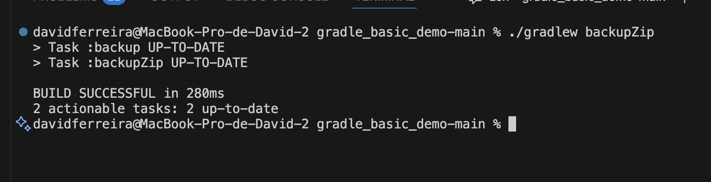
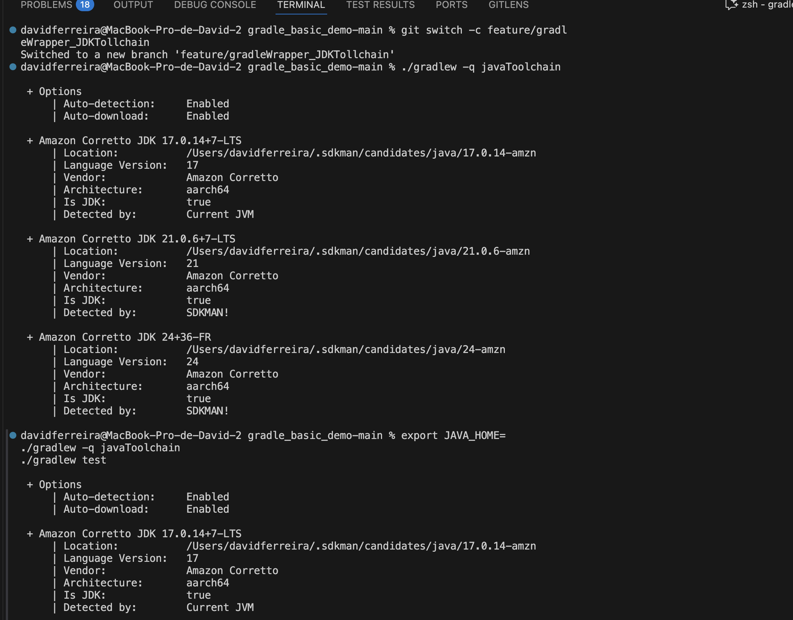
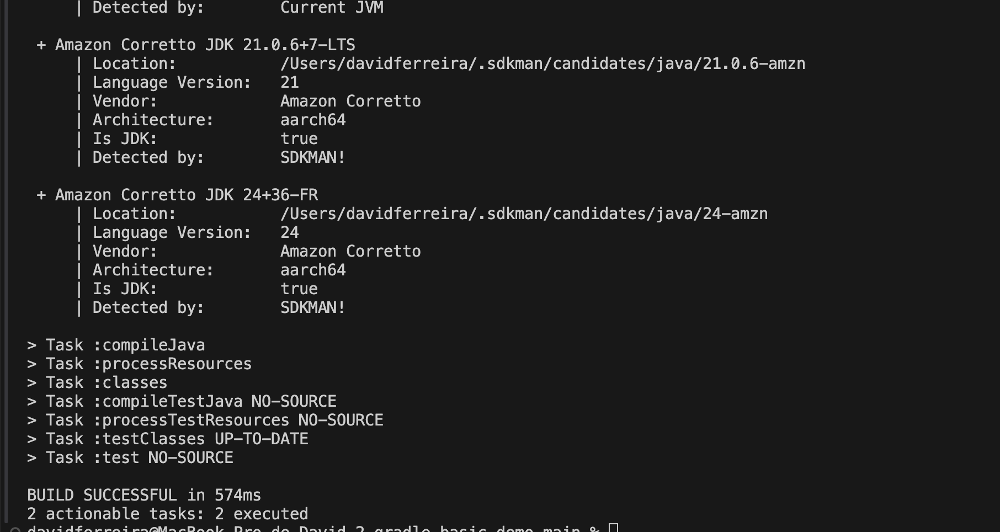
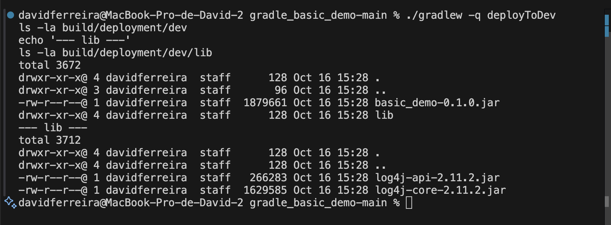

# Technical Report CA02

Technical report do CA02 no âmbito da UC de COGSI realizado por:

1. David Ferreira - 1240444
2. Rafael Gomes - 1211426
3. Nuno Cunha - 1211689

## Issue 24 - Add custom Gradle task runServer

Em primeiro lugar, é necessário compreender o que deve ser feito para colocar o módulo da app em execução. Para isso, é preciso fazer o *build* do projeto e executar o comando ***java -cp build/libs/basic_demo-0.1.0.jar basic_demo.ChatServerApp "server port"***, conforme indicado no ficheiro README.
Este comando serve para indicar qual o método main que deve ser executado e para definir os argumentos necessários ao seu funcionamento.

        nacunha@cogsi$ ./gradlew build
        > Task :compileJava UP-TO-DATE
        > Task :processResources UP-TO-DATE
        > Task :classes UP-TO-DATE
        > Task :jar UP-TO-DATE
        > Task :startScripts UP-TO-DATE
        > Task :distTar UP-TO-DATE
        > Task :distZip UP-TO-DATE
        > Task :assemble UP-TO-DATE
        > Task :compileTestJava NO-SOURCE
        > Task :processTestResources NO-SOURCE
        > Task :testClasses UP-TO-DATE
        > Task :test NO-SOURCE
        > Task :check UP-TO-DATE
        > Task :build UP-TO-DATE

        BUILD SUCCESSFUL in 845ms
        6 actionable tasks: 6 up-to-date
        nacunha@cogsi$ java -cp build/libs/basic_demo-0.1.0.jar basic_demo.ChatServerApp 59001
        The chat server is running...

**NOTA**: o caminho para a pasta foi abreviado de forma a facilitar a leitura do *output*.

Posto isto, é agora necessário proceder à criação da *task* no ficheiro ***build.gradle***:

        task runServer(type:JavaExec){
            group = "COGSI"

            description = "Task that starts the Chat App"

            dependsOn build

            classpath = sourceSets.main.runtimeClasspath

            mainClass = 'basic_demo.ChatServerApp'

            args '59001'
        }

Analisando a mesma por linhas, podemos observar o seguinte:

1. A *task* criada é do tipo *JavaExec*, o que significa que a mesma irá executar uma aplicação *Java* num processo filho.
2. Foi criado um grupo de *tasks* com o nome COGSI, para fins organizacionais.
3. Dada uma descrição pertinente do objetivo da mesma.
4. Utilizando a ferramenta de ordenação de *tasks* ***dependsOn*** garantimos que a *task* criada irá ser executada caso o *build* do projeto seja bem sucedido.
5. A variável ***classpath*** serve para informar o *Gradle* sobre onde encontrar o código compilado, os recursos e as bibliotecas necessárias para executar o programa.
6. A variável ***mainClass*** indica ao *Gradle* qual a classe que contém o método *main* a ser executado sendo-lhes passados os parâmetros necessários, sendo neste caso apenas o porto onde deve ser executada a aplicação.

Tendo já sido criada a *task* resta testar o seu funcionamento utilizando o comando ***./gradlew runServer***.

        nacunha@cogsi$ ./gradlew runServer
        > Task :compileJava UP-TO-DATE
        > Task :processResources UP-TO-DATE
        > Task :classes UP-TO-DATE
        > Task :jar UP-TO-DATE
        > Task :startScripts UP-TO-DATE
        > Task :distTar UP-TO-DATE
        > Task :distZip UP-TO-DATE
        > Task :assemble UP-TO-DATE
        > Task :compileTestJava NO-SOURCE
        > Task :processTestResources NO-SOURCE
        > Task :testClasses UP-TO-DATE
        > Task :test NO-SOURCE
        > Task :check UP-TO-DATE
        > Task :build UP-TO-DATE
        
        > Task :runServer
        The chat server is running...
        
Como é possível observar no *output* anterior, o código foi totalmente compilado e está operacional, dado que o output foi igual ao obtido quando utilizados os comandos individuais de *build* e execução.

## Issue 25 - Add a unit test and enable Gradle test execution

Para implementar os testes, foi necessário criar uma pasta dedicada, com uma estrutura semelhante à da pasta que contém o código-fonte da aplicação. Posteriormente, foi criada uma classe de testes correspondente a cada classe do domínio. Neste caso, como o objetivo é apenas demonstrar a interligação entre uma *task* e a execução de testes, foi criada apenas uma classe de teste que valida uma funcionalidade simples.

        package basic_demo;

        import org.junit.jupiter.api.Test;
        import static org.junit.jupiter.api.Assertions.*;

        public class ChatClientTest {

            @Test
            void testChatClientCreation() {
                ChatClient client = new ChatClient("localhost", 59001);
                assertNotNull(client, "ChatClient Created with Success");
            }
        }

Tendo sido o teste criado é necessário, de seguida, editar o ficheiro *build.gradle* e criar-se a *task* que executará os testes, bem como, adicionar-se os módulos necessários às dependências do projeto.

Relativamente às dependências do projeto, foram adicionadas as últimas duas linhas do código abaixo. Estas tratam de adicionar às dependências todos os módulos relativos ao ***junit***, na versão 5.10.

        dependencies {
            // Use Apache Log4J for logging
            implementation group: 'org.apache.logging.log4j', name: 'log4j-api', version: '2.11.2'
            implementation group: 'org.apache.logging.log4j', name: 'log4j-core', version: '2.11.2'
            testImplementation 'org.junit.jupiter:junit-jupiter-api:5.10.0'
            testRuntimeOnly 'org.junit.jupiter:junit-jupiter-engine:5.10.0'
        }

Observando agora a *task* criada:

        task testChatClient(type: Test) {
            group = "COGSI"                          
            description = "Executa apenas o teste da classe ChatClient"
            dependsOn build                          

            useJUnitPlatform()                       

            testClassesDirs = sourceSets.test.output.classesDirs  
        
            classpath = sourceSets.test.runtimeClasspath          

            include '**/ChatClientTest.class'        
        }

Analisando linha a linha, pode-se afirmar o seguinte:

1. A task é do tipo Test, o que significa que será responsável pela execução dos testes, neste caso, utilizando o JUnit.
2. Tal como no *issue* anterior, é-lhe atribuído o grupo COGSI, uma descrição coerente com a sua função e definida uma dependência em relativamente ao sucesso do *build* do projeto.
3. Ao ser utilizado o método ***useJUnitPlatform()*** indica será utilizado a versão 5 do *junit*.
4. As três últimas linhas indicam o caminho das classes de teste, das dependências e, por fim, neste caso, filtra a execução apenas ao teste criado anteriormente.

Posto isto, para correr a *task* é necessário correr o comando ***./gradlew testChatClient***, é importante sublinhar que é necessário correr este teste numa máquina com ambiente gráfico, por isso, de forma excecional a task foi corrida numa máquina *Windows*.

        PS C:\Shared\cogsi2526-1240444-1211426-1211689\CA2\Part1\gradle_basic_demo-main> ./gradlew testChatClient
        > Task :compileJava UP-TO-DATE
        > Task :processResources UP-TO-DATE
        > Task :classes UP-TO-DATE
        > Task :compileTestJava UP-TO-DATE
        > Task :processTestResources NO-SOURCE
        > Task :testClasses UP-TO-DATE
        > Task :testChatClient UP-TO-DATE

        BUILD SUCCESSFUL in 1s
        4 actionable tasks: 4 up-to-date

Para além de conseguirmos ver que todo o build foi sucedido, podemos ainda verificar um ficheiro HTML criado automaticamente onde temos toda a informação relativa ao resultado dos testes, como revela a seguinte imagem.


<<<<<<< Updated upstream
## Issue 25 - Add Gradle task backup to copy src to backup/
=======
## Issue 26 - Add Gradle task backup to copy src to backup/
>>>>>>> Stashed changes

Este *issue* descreve a adição de uma *task* Gradle que utiliza o tipo embutido `Copy` para criar uma cópia da pasta `src` para uma nova pasta `backup/` no diretório do projeto. O objetivo é fornecer uma forma rápida e reproduzível de criar uma cópia de segurança dos ficheiros fonte.

Explicação da tarefa:

1. Foi adicionada uma *task* chamada `backup` no ficheiro `build.gradle` com o tipo `Copy`.
2. A *task* copia todo o conteúdo da pasta `src` para uma pasta `backup` na raiz do projeto usando as propriedades `from` e `into`.
3. A task é intencionalmente simples e determinística: pode ser executada localmente sem dependências adicionais e pode ser encadeada noutras tasks (por exemplo `backupZip` no mesmo ficheiro) usando `dependsOn`.

Trecho relevante do `build.gradle` (implementação da *task*):

                task backup(type: Copy) {
                        group = "COGSI"
                        description = "Copies the src directory to a backup directory"

                        from 'src'
                        into 'backup'
                }

Partes mais importantes da implementação da task `backup`:

- `task backup(type: Copy)`: declara a task usando o tipo built-in `Copy`, que fornece comportamento padrão de cópia com suporte a estruturas de pastas, filtros e performance do Gradle.
- `group = "COGSI"`: organiza a task no grupo `COGSI` para facilitar a descoberta ao listar tasks (`./gradlew tasks`).
- `description = "Copies the src directory to a backup directory"`: fornece uma descrição legível que aparece nas listagens de tasks e ajuda na documentação.
- `from 'src'`: especifica a origem da cópia — toda a árvore de ficheiros em `src` será incluída.
- `into 'backup'`: define o destino da cópia; a pasta `backup/` será criada se não existir e a estrutura interna será preservada.

Como verificar (passos executados):

1. Mudar para o directório do projecto onde se encontra o `build.gradle`.

        ```bash
        cd /path/to/gradle_basic_demo-main
        ```

2. Executar a task `backup`:

        ```bash
        ./gradlew backup
        ```

3. Verificar que a pasta `backup/` foi criada e que contém uma cópia do conteúdo de `src` (p. ex. `src/main` aparece em `backup/main`):

        ```bash
        ls -la backup
        ```

Exemplo de output observado durante a verificação realizada neste trabalho:

        > Task :backup

        BUILD SUCCESSFUL in 11s
        1 actionable task: 1 executed

        total 12
        drwxr-xr-x 3 rafael rafael 4096 Oct 12 17:20 .
        drwxr-xr-x 7 rafael rafael 4096 Oct 12 18:49 ..
        drwxr-xr-x 4 rafael rafael 4096 Oct 12 17:20 main

## Issue 27 - Adicionar task zipBackup (tipo Zip)

Objetivo: Criar um ficheiro `backup.zip` contendo uma cópia da árvore de fontes (`src/`). Para garantir que o conteúdo está atualizado, a nova task deve depender da task `backup` (que copia `src` para a pasta `backup/`).

Implementação adicionada ao `build.gradle`:

    task backup(type: Copy) {
            from 'src'
            into 'backup'
    }

    task zipBackup(type: Zip) {
            group = "DevOps"
            description = "Creates a zip archive of the backup directory (depends on backup)"
            dependsOn backup
            from 'backup'
            archiveFileName = 'backup.zip'
            destinationDirectory = file('.')
    }
```gradle
task backup(type: Copy) {
        from 'src'
        into 'backup'
}

task zipBackup(type: Zip) {
        group = "DevOps"
        description = "Creates a zip archive of the backup directory (depends on backup)"
        dependsOn backup
        from 'backup'
        archiveFileName = 'backup.zip'
        destinationDirectory = file('.')
}
```

Explicação técnica:

1. `type: Copy` na task `backup` garante a duplicação simples dos ficheiros (mantendo estrutura relativa) antes da compressão.
2. `type: Zip` na task `zipBackup` usa o mecanismo interno do Gradle para agregação de ficheiros num artefacto `.zip`.
3. `dependsOn backup` cria uma aresta explícita no grafo de execução assegurando que a origem (`backup/`) está pronta.
4. `from 'backup'` define a raiz a arquivar; não usamos diretamente `src/` para manter a intencionalidade de uma cópia congelada.
5. `destinationDirectory = file('.')` coloca o artefacto no diretório do projeto (poderia ser `build/distributions` se quiséssemos isolar outputs).

Execução:

```
./gradlew zipBackup
```

Output observado:

```
> Task :backup UP-TO-DATE
> Task :zipBackup

BUILD SUCCESSFUL in 2s
2 actionable tasks: 1 executed, 1 up-to-date
```

Artefactos resultantes:
- Diretoria `backup/`
- Ficheiro `backup.zip`

Imagem de suporte (execução da task):



## Issue 28 - Explicar Gradle Wrapper e JDK Toolchain

Requisitos: Demonstrar como o *Gradle Wrapper* e a *Java Toolchain* asseguram versões consistentes (Gradle 8.9 + Java 17) sem necessidade de instalações manuais divergentes.

Configuração existente no `build.gradle`:

```gradle
java {
        toolchain {
                languageVersion = JavaLanguageVersion.of(17)
        }
}
```

Foi ainda criada uma task auxiliar para recolher informação de diagnóstico:

```gradle
tasks.register('javaToolchain') {
        group = "Help"
        description = "Prints information about the configured Java toolchain"
        doLast {
                println "Java Toolchain (languageVersion): ${java.toolchain.languageVersion.get()}"
                println "Current JVM version: ${System.getProperty('java.version')}"
                println "Gradle version: ${gradle.gradleVersion} (Wrapper governs this)"
                println "JAVA_HOME: ${System.getenv('JAVA_HOME')}"
        }
}
```

Execução silenciosa:

```
./gradlew -q javaToolchain
```

Output recolhido (exemplo):

```
Java Toolchain (languageVersion): 17
Current JVM version: 17.0.14
Gradle version: 8.9 (Wrapper governs this)
JAVA_HOME: /Users/<user>/.sdkman/candidates/java/current
```

Análise:

1. O Wrapper (`gradlew`) descarrega / utiliza a distribuição exata de Gradle definida em `gradle/wrapper/gradle-wrapper.properties`, evitando discrepâncias de versões entre máquinas.
2. A *toolchain* declara a versão alvo de Java (17). O Gradle tenta localizar internamente um JDK compatível; quando configurado com *provisioning*, pode mesmo descarregar (dependendo das features usadas).
3. A compilação fica isolada de *overrides* acidentais do `JAVA_HOME` ou de JDKs mais recentes/antigos disponíveis localmente.
4. Em CI/CD basta chamar `./gradlew build`, reduzindo fricção operacional.




A combinação Wrapper + Toolchain aumenta reprodutibilidade, reduz *onboarding time* e minimiza falhas introduzidas por ambientes heterogéneos.

## Issue 30 & 31 - Initial Commit + Adding necessary dependencies

Para o *commit* inicial, da parte 2 do CA2, ser feito o que se fez foi criar uma pasta vazia e nesta correu-se o comando ***gradle init*** para que um projeto *gradle* fosse iniciado na mesma. De seguida foi pedida a nossa informação relativamente a alguns ponto necessários para a criação do projeto *gradle*:

nacunha@cogsi:/mnt/hgfs/Shared/cogsi2526-1240444-1211426-1211689/CA2/Part2$ gradle init

        Select type of build to generate:
          1: Application
          2: Library
          3: Gradle plugin
          4: Basic (build structure only)
        Enter selection (default: Application) [1..4] 1
        
        Select implementation language:
          1: Java
          2: Kotlin
          3: Groovy
          4: Scala
          5: C++
          6: Swift
        Enter selection (default: Java) [1..6] 1
        
        Enter target Java version (min: 7, default: 21): 21
        
        Project name (default: Part2): 
        
        Select application structure:
          1: Single application project
          2: Application and library project
        Enter selection (default: Single application project) [1..2] 1
        
        Select build script DSL:
          1: Kotlin
          2: Groovy
        Enter selection (default: Kotlin) [1..2] 2
        
        Select test framework:
          1: JUnit 4
          2: TestNG
          3: Spock
          4: JUnit Jupiter
        Enter selection (default: JUnit Jupiter) [1..4] 4
        
        Generate build using new APIs and behavior (some features may change in the next minor release)? (default: no) [yes, no] yes
        
        
        > Task :init
        Learn more about Gradle by exploring our Samples at https://docs.gradle.org/9.1.0/samples/sample_building_java_applications.html
        
        BUILD SUCCESSFUL in 16s
        1 actionable task: 1 executed
        nacunha@cogsi:/mnt/hgfs/Shared/cogsi2526-1240444-1211426-1211689/CA2/Part2$ 

Como é possível observar no *output* acima, foram escolhidas as seguintes opções:

1. ***Application*** - Usado quando o objetivo do projeto é desenvolver uma aplicação.
2. ***Java*** - Selecionado dado que a aplicação de teste é totalmente desenvolvida em *Java* e a *framework* usada é o *Spring Boot*.
3. ***Java Version*** - Fui selecionada a versão 21 por ser a mais recente.
4. **Estrutura** - Dado que o projeto de testes tem apenas um módulo aplicacional foi selecionada a primeira opção que é direcionada a essa situação.
5. **Linguagem dos *scripts DSL*** - Escolhido o **Groovy** para manter a uniformidade durante todo o CA2.
6. ***Framework* de testes** - Escolhido o *Junit Jupiter* por ser a versão mais recente.

Posto isto, obtivemos um projeto com a seguinte árvore de diretórios:

        Part2/
        ├── .gradle/
        ├── app/
        │ ├── build/
        │ ├── src/
        │ │ ├── main/
        │ │ │ ├── java/
        │ │ │ └── resources/
        │ │ └── test/
        │ │ ├── java/
        │ │ └── resources/
        │ └── build.gradle
        ├── build/
        │ └── reports/
        ├── gradle/
        ├── .gitattributes
        ├── .gitignore
        ├── gradle.properties
        ├── gradlew
        ├── gradlew.bat
        └── settings.gradle

Tendo a estrutura do projeto feita resta copiar o contéudo da pasta **links** da aplicação de teste para a pasta **src** do novo projeto dando assim por finalizando o *commit* inicial, assim, por consequência, podemos afirmar que o *Issue 30* está concluido.

Passando agora à injeção de dependências necessárias, começamos por observar o ficheiro ***build.gradle*** criado:

        /*
         * This file was generated by the Gradle 'init' task.
         *
         * This generated file contains a sample Java application project to get you started.
         * For more details on building Java & JVM projects, please refer to https://docs.gradle.org/9.1.0/userguide/building_java_projects.html in the Gradle documentation.
         * This project uses @Incubating APIs which are subject to change.
         */

        plugins {
            // Apply the application plugin to add support for building a CLI application in Java.
            id 'application'
        }

        repositories {
            // Use Maven Central for resolving dependencies.
            mavenCentral()
        }

        dependencies {
            // This dependency is used by the application.
            implementation libs.guava
        }

        testing {
            suites {
                // Configure the built-in test suite
                test {
                    // Use JUnit Jupiter test framework
                    useJUnitJupiter('5.12.1')
                }
            }
        }

        // Apply a specific Java toolchain to ease working on different environments.
        java {
            toolchain {
                languageVersion = JavaLanguageVersion.of(21)
            }
        }

        application {
            // Define the main class for the application.
            mainClass = 'org.example.AppTest'
        }

Posto isto, passou-se a observar os ficheiros ***pom.xml*** encontrados no projeto usado para testes. É importante sublinhar que no projeto usado como exemplo existem dois ficheiros *pom*, um global que afeta todos os módulos da aplicação e um ficheiro *pom* dentro de cada módulo. Poderia ter-se usado a mesma abordagem na Part2, contudo como a aplicação só têm um módulo decidiu-se alterar o ficheiro ***build.gradle*** apenas desse módulo. 

Ficheiro ***pom.xml*** global:

        <?xml version="1.0" encoding="UTF-8"?>
        <project xmlns="http://maven.apache.org/POM/4.0.0" xmlns:xsi="http://www.w3.org/2001/XMLSchema-instance"
        		 xsi:schemaLocation="http://maven.apache.org/POM/4.0.0 https://maven.apache.org/xsd/maven-4.0.0.xsd">
        	<modelVersion>4.0.0</modelVersion>

        	<parent>
        		<groupId>org.springframework.boot</groupId>
        		<artifactId>spring-boot-starter-parent</artifactId>
        		<version>3.2.5</version>
        	</parent>

        	<groupId>org.springframework.guides</groupId>
        	<artifactId>tut-rest</artifactId>
        	<version>0.0.1-SNAPSHOT</version>
        	<packaging>pom</packaging>

        	<properties>
        		<project.build.sourceEncoding>UTF-8</project.build.sourceEncoding>
        		<java.version>17</java.version>
        	</properties>

        	<modules>
        		<module>nonrest</module>
        		<module>rest</module>
        		<module>evolution</module>
        		<module>links</module>
        	</modules>

        	<dependencies>
        		<dependency>
        			<groupId>org.springframework.boot</groupId>
        			<artifactId>spring-boot-starter-test</artifactId>
        			<scope>test</scope>
        		</dependency>
        	</dependencies>
        
        </project>

Deste ficheiro, podemos retirar o seguinte:

1. É necessário utilizar o *plugin* ***org.springframework.boot*** na versão 3.2.5.
2. A versão do *Java* é a 17.
3. Necessário injetar a dependència ***spring-boot-starter-test*** do *plugin* acima referido.

Ficheiro ***pom.xml*** do módulo aplicacional:

        <?xml version="1.0" encoding="UTF-8"?>
        <project xmlns="http://maven.apache.org/POM/4.0.0"
        		 xmlns:xsi="http://www.w3.org/2001/XMLSchema-instance"
        		 xsi:schemaLocation="http://maven.apache.org/POM/4.0.0 https://maven.apache.org/xsd/maven-4.0.0.xsd">
        	<modelVersion>4.0.0</modelVersion>

        	<parent>
        		<groupId>org.springframework.guides</groupId>
        		<artifactId>tut-rest</artifactId>
        		<version>0.0.1-SNAPSHOT</version>
        	</parent>

        	<artifactId>links</artifactId>
        	<version>0.0.1-SNAPSHOT</version>

        	<dependencies>

        		<dependency>
        			<groupId>org.springframework.boot</groupId>
        			<artifactId>spring-boot-starter-web</artifactId>
        		</dependency>

        		<dependency>
        			<groupId>org.springframework.boot</groupId>
        			<artifactId>spring-boot-starter-data-jpa</artifactId>
        		</dependency>

        		<dependency>
        			<groupId>org.springframework.boot</groupId>
        			<artifactId>spring-boot-starter-hateoas</artifactId>
        		</dependency>

        		<dependency>
        			<groupId>com.h2database</groupId>
        			<artifactId>h2</artifactId>
        			<scope>runtime</scope>
        		</dependency>

        	</dependencies>

        	<build>
        		<plugins>
        			<plugin>
        				<groupId>org.springframework.boot</groupId>
        				<artifactId>spring-boot-maven-plugin</artifactId>
        			</plugin>
        		</plugins>
        	</build>

        </project>

Deste ficheiro retiramos que devemos injetar as seguintes dependências:

1. ***spring-boot-starter-web***
2. ***spring-boot-starter-data-jpa***
3. ***spring-boot-starter-hateoas***
4. ***h2***, esta da biblioteca *com.h2database*

Posto isto, o aspeto do ficheiro ***build.gradle*** ficou o seguinte:

        /*
         * This file was generated by the Gradle 'init' task.
         *
         * This generated file contains a sample Java application project to get you started.
         * For more details on building Java & JVM projects, please refer to https://docs.gradle.org/9.1.0/userguide/building_java_projects.html in the Gradle documentation.
         * This project uses @Incubating APIs which are subject to change.
         */

        plugins {
            // Apply the application plugin to add support for building a CLI application in Java.
            id 'application'
            id 'java'
            id 'org.springframework.boot' version '3.2.5'
        }

        apply plugin: 'io.spring.dependency-management'

        repositories {
            // Use Maven Central for resolving dependencies.
            mavenCentral()
        }

        dependencies {
            // This dependency is used by the application.
            implementation libs.guava
            implementation 'org.springframework.boot:spring-boot-starter-web'
            implementation 'org.springframework.boot:spring-boot-starter-data-jpa'
            implementation 'org.springframework.boot:spring-boot-starter-hateoas'
            runtimeOnly 'com.h2database:h2'
            testImplementation 'org.springframework.boot:spring-boot-starter-test'
        }

        testing {
            suites {
                // Configure the built-in test suite
                test {
                    // Use JUnit Jupiter test framework
                    useJUnitJupiter('5.12.1')
                }
            }
        }

        // Apply a specific Java toolchain to ease working on different environments.
        java {
            toolchain {
                languageVersion = JavaLanguageVersion.of(17)
            }
        }

        application {
            // Define the main class for the application.
            mainClass = 'payroll.PayrollApplication'
        }

Como é possível observar, foram adicionados os *plugins* ***java***, ***org.springframework.boot*** e o ***io.spring.dependency-management***, tal como é sugerido na documentação do *Spring Boot*. Posteriormente, foram adicionadas as dependências anteriormente detetadas e, por fim, alterada a função *main*. Posto isto, podemos colocar em execução o projeto e surgiu um erro e o *build* falhou.

        nacunha@cogsi:/mnt/hgfs/Shared/cogsi2526-1240444-1211426-1211689/CA2/Part2$ ./gradlew bootRun
        Calculating task graph as no cached configuration is available for tasks: bootRun

        1 problem was found storing the configuration cache.
        - Task `:app:compileJava` of type `org.gradle.api.tasks.compile.JavaCompile`: error writing value of type 'org.gradle.api.internal.artifacts.configurations.DefaultLegacyConfiguration'

        See the complete report at file:///mnt/hgfs/Shared/cogsi2526-1240444-1211426-1211689/CA2/Part2/build/reports/configuration-cache/52is54ud52k743z2w3ofxi0bw/1auasmoaxpqwawxdgqf8vxy7g/configuration-cache-report.html

        [Incubating] Problems report is available at: file:///mnt/hgfs/Shared/cogsi2526-1240444-1211426-1211689/CA2/Part2/build/reports/problems/problems-report.html

        FAILURE: Build failed with an exception.

        * What went wrong:
        Configuration cache state could not be cached: field `annotationProcessorPath` of `org.gradle.api.tasks.compile.CompileOptions_Decorated` bean found in field `capturedArgs` of `java.lang.invoke.SerializedLambda` bean found in field `spec` of `org.gradle.api.internal.tasks.execution.SelfDescribingSpec` bean found in task `:app:compileJava` of type `org.gradle.api.tasks.compile.JavaCompile`: error writing value of type 'org.gradle.api.internal.artifacts.configurations.DefaultLegacyConfiguration'
        > Failed to notify dependency resolution listener.
           > 'java.util.Set org.gradle.api.artifacts.LenientConfiguration.getArtifacts(org.gradle.api.specs.Spec)'

        * Try:
        > Run with --stacktrace option to get the stack trace.
        > Run with --info or --debug option to get more log output.
        > Run with --scan to generate a Build Scan (Powered by Develocity).
        > Get more help at https://help.gradle.org.

        BUILD FAILED in 1s
        Configuration cache entry discarded due to serialization error.

Este erro deve-se ao facto de o *Spring Boot* não ser compatível com o *Gradle 9.1.0*, sendo assim, basta alterar a versão do *Gradle*, no ficheiro ***gradle-wraper.properties***, para a versão 8.14.3, que é a atual da versão 8. 

        istributionBase=GRADLE_USER_HOME
        istributionPath=wrapper/dists
        istributionUrl=https\://services.gradle.org/distributions/gradle-8.14.3-bin.zip
        etworkTimeout=10000
        alidateDistributionUrl=true
        ipStoreBase=GRADLE_USER_HOME
        ipStorePath=wrapper/dists

Sendo este erro corrigido, é possível executar o projeto, como mostra o seguinte *output*:

nacunha@cogsi:/mnt/hgfs/Shared/cogsi2526-1240444-1211426-1211689/CA2/Part2$ ./gradlew bootRun
Calculating task graph as configuration cache cannot be reused because the file system entry 'app/build/classes/java/main' has been created.

        > Task :app:bootRun

          .   ____          _            __ _ _
         /\\ / ___'_ __ _ _(_)_ __  __ _ \ \ \ \
        ( ( )\___ | '_ | '_| | '_ \/ _` | \ \ \ \
         \\/  ___)| |_)| | | | | || (_| |  ) ) ) )
          '  |____| .__|_| |_|_| |_\__, | / / / /
         =========|_|==============|___/=/_/_/_/
         :: Spring Boot ::                (v3.2.5)

        2025-10-16T15:02:18.322Z  INFO 2906 --- [           main] payroll.PayrollApplication               : Starting PayrollApplication using Java 21.0.8 with PID 2906 (/mnt/hgfs/Shared/cogsi2526-1240444-1211426-1211689/CA2/Part2/app/build/classes/java/main started by nacunha in /mnt/hgfs/Shared/cogsi2526-1240444-1211426-1211689/CA2/Part2/app)
        2025-10-16T15:02:18.325Z  INFO 2906 --- [           main] payroll.PayrollApplication               : No active profile set, falling back to 1 default profile: "default"
        2025-10-16T15:02:19.074Z  INFO 2906 --- [           main] .s.d.r.c.RepositoryConfigurationDelegate : Bootstrapping Spring Data JPA repositories in DEFAULT mode.
        2025-10-16T15:02:19.127Z  INFO 2906 --- [           main] .s.d.r.c.RepositoryConfigurationDelegate : Finished Spring Data repository scanning in 46 ms. Found 2 JPA repository interfaces.
        2025-10-16T15:02:19.639Z  INFO 2906 --- [           main] o.s.b.w.embedded.tomcat.TomcatWebServer  : Tomcat initialized with port 8080 (http)
        2025-10-16T15:02:19.652Z  INFO 2906 --- [           main] o.apache.catalina.core.StandardService   : Starting service [Tomcat]
        2025-10-16T15:02:19.652Z  INFO 2906 --- [           main] o.apache.catalina.core.StandardEngine    : Starting Servlet engine: [Apache Tomcat/10.1.20]
        2025-10-16T15:02:19.695Z  INFO 2906 --- [           main] o.a.c.c.C.[Tomcat].[localhost].[/]       : Initializing Spring embedded WebApplicationContext
        2025-10-16T15:02:19.696Z  INFO 2906 --- [           main] w.s.c.ServletWebServerApplicationContext : Root WebApplicationContext: initialization completed in 1336 ms
        2025-10-16T15:02:19.814Z  INFO 2906 --- [           main] com.zaxxer.hikari.HikariDataSource       : HikariPool-1 - Starting...
        2025-10-16T15:02:20.009Z  INFO 2906 --- [           main] com.zaxxer.hikari.pool.HikariPool        : HikariPool-1 - Added connection conn0: url=jdbc:h2:mem:15039a37-c397-4ef5-954a-1ee735bc186e user=SA
        2025-10-16T15:02:20.011Z  INFO 2906 --- [           main] com.zaxxer.hikari.HikariDataSource       : HikariPool-1 - Start completed.
        2025-10-16T15:02:20.046Z  INFO 2906 --- [           main] o.hibernate.jpa.internal.util.LogHelper  : HHH000204: Processing PersistenceUnitInfo [name: default]
        2025-10-16T15:02:20.105Z  INFO 2906 --- [           main] org.hibernate.Version                    : HHH000412: Hibernate ORM core version 6.4.4.Final
        2025-10-16T15:02:20.145Z  INFO 2906 --- [           main] o.h.c.internal.RegionFactoryInitiator    : HHH000026: Second-level cache disabled
        2025-10-16T15:02:20.420Z  INFO 2906 --- [           main] o.s.o.j.p.SpringPersistenceUnitInfo      : No LoadTimeWeaver setup: ignoring JPA class transformer
        2025-10-16T15:02:21.443Z  INFO 2906 --- [           main] o.h.e.t.j.p.i.JtaPlatformInitiator       : HHH000489: No JTA platform available (set 'hibernate.transaction.jta.platform' to enable JTA platform integration)
        2025-10-16T15:02:21.493Z  INFO 2906 --- [           main] j.LocalContainerEntityManagerFactoryBean : Initialized JPA EntityManagerFactory for persistence unit 'default'
        2025-10-16T15:02:21.752Z  WARN 2906 --- [           main] JpaBaseConfiguration$JpaWebConfiguration : spring.jpa.open-in-view is enabled by default. Therefore, database queries may be performed during view rendering. Explicitly configure spring.jpa.open-in-view to disable this warning
        2025-10-16T15:02:22.178Z  INFO 2906 --- [           main] o.s.b.w.embedded.tomcat.TomcatWebServer  : Tomcat started on port 8080 (http) with context path ''
        2025-10-16T15:02:22.184Z  INFO 2906 --- [           main] payroll.PayrollApplication               : Started PayrollApplication in 4.265 seconds (process running for 4.651)
        2025-10-16T15:02:22.378Z  INFO 2906 --- [           main] payroll.LoadDatabase                     : Preloaded Employee{id=1, firstName='Bilbo', lastName='Baggins', role='burglar'}
        2025-10-16T15:02:22.378Z  INFO 2906 --- [           main] payroll.LoadDatabase                     : Preloaded Employee{id=2, firstName='Frodo', lastName='Baggins', role='thief'}
        2025-10-16T15:02:22.383Z  INFO 2906 --- [           main] payroll.LoadDatabase                     : Preloaded Order{id=1, description='MacBook Pro', status=COMPLETED}
        2025-10-16T15:02:22.383Z  INFO 2906 --- [           main] payroll.LoadDatabase                     : Preloaded Order{id=2, description='iPhone', status=IN_PROGRESS}
        <==========---> 80% EXECUTING [11s]
        > :app:bootRun

Para uma melhor validação podemos abrir o seguinte URL: http://<ip>:8080/employees e verificar se obtemos a informação dos empregados.


## Issue 32 - Custom Gradle task deployToDev

Objetivo: criar uma pipeline de deployment local (DEV) usando apenas tasks built-in do Gradle, com os seguintes passos em sequência:

- Delete: limpar a diretoria de deployment (`build/deployment/dev`).
- Copy: copiar o artefacto principal (JAR) para `build/deployment/dev`.
- Copy: copiar apenas as dependências de runtime (JARs) para `build/deployment/dev/lib`.
- Copy + ReplaceTokens: copiar ficheiros `src/main/resources/*.properties` para `build/deployment/dev`, aplicando substituição de tokens (`@projectVersion@` e `@buildTimestamp@`).

Comando executado e validação:

```bash
./gradlew -q deployToDev
ls -la build/deployment/dev
echo '--- lib ---'
ls -la build/deployment/dev/lib
```

Output observado:


